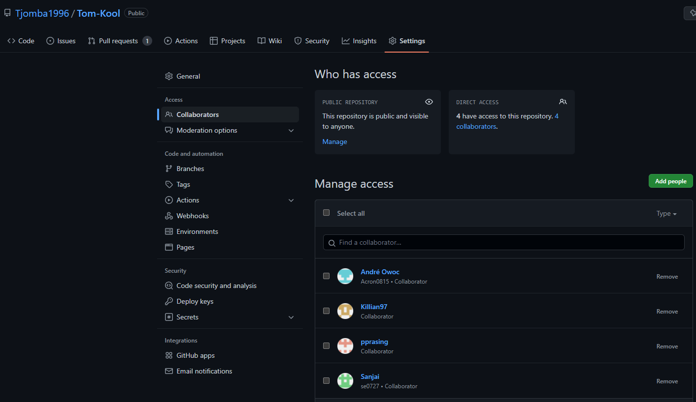
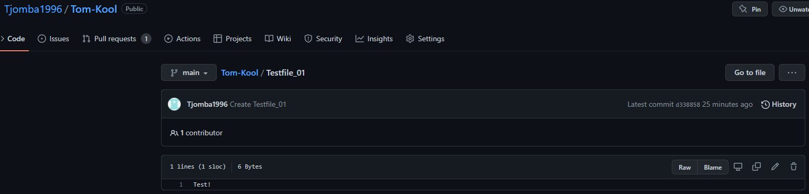
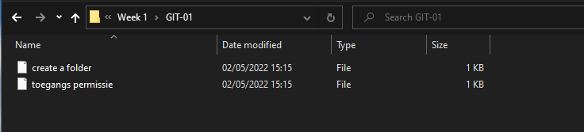

# Git and GitHub
Git is distributed version control system. It helps individuals to view, manage and adjust code, without interfering with eachother. 
## Key terminology
- Repository = a place to storage files

- Push / Pull = To push code, is to have the remote access code be updated with the code that one has on their local machine. To pull code, is to get it from the remote access platform to the local machine

- Merge = to combine

- Fork = Forking is to take the source code from an open source software program and develop a new code with the source code as a base

## Exercise
 - Make a GitHub account
 - Make a repository
 - Give permission to your peers to access your repository
 - Push code into repository
 - Pull / Clone repository from peer
 
 - Add repository for Portfolio
 - Push Notes to Repository

### Sources
https://www.alpharithms.com/how-to-create-a-folder-in-github-repos-463022/

https://medium.com/markdown-monster-blog/getting-images-into-markdown-documents-and-weblog-posts-with-markdown-monster-9ec6f353d8ec

https://debug.to/1088/how-to-change-folder-name-in-github

### Overcome challenges
- Getting comfortable with GitHub.
- Pushing and pulling files from both peers and myself.
- Getting familiar with Markdown and it's syntax.

### Results

