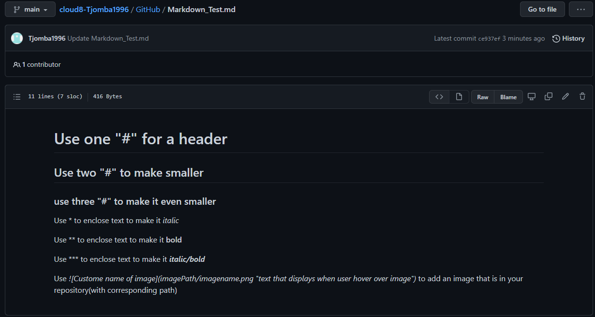

# Markdown
Using Word as a text editor and saving as a ".word" document can sometimes cause some issues. This is due to the fact that word adds layout code to the file, so it can interpret what the document is supposed to look like. Sometimes it's beneficial to use a different solution for a text file. This is why **Markdown** was introduced. This way you can use a "raw" text file, that is also still readable by the user, and with simple syntax, can be giving layout(to be interpreted by the system your using).

## Key terminology
- Markdown = Is a text-to-html conversion tool, MarkUp-Language
- WYSIWYG = "What you see is what you get". Word is an example of a WYSIWYG programm, as it shows you exactly what the document is gonna look like, while you're editing it
- WYSIWYM = "What you see is what you mean". Markdown is a example of a WYSIWYM solution. The emphasis lies on the information giving and the exact layout is interpreted by the rendering party. 

## Exercise
- Make a document with a chosen text editor

### Sources
https://nl.wikipedia.org/wiki/Wysiwyg

https://en.wikipedia.org/wiki/WYSIWYM

https://zeroesandones.medium.com/how-to-commit-and-push-your-changes-to-your-github-repository-in-vscode-77a7a3d7dd02

https://community.atlassian.com/t5/Trello-questions/Markdown-syntax-causing-issues/qaq-p/666843

https://github.com/adam-p/markdown-here/wiki/Markdown-Cheatsheet

### Overcome challenges
 - Learned how to push and pull through text editor: VScode
 - Learned simple syntax like bold, italic, headers and how to ignore syntax.
 - Learned how to add images to Markdown files.

### Results

