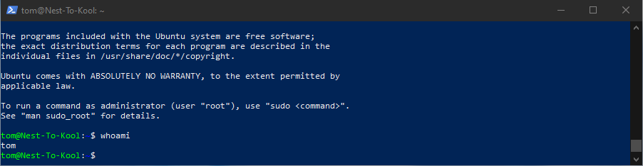

# Setting up Linux
Linux, like Windows or MacOS, is an operating system. It manages the communication between the physical device (hardware) and all computer programs (software).
Linux is the most popular operating system for servers, because it is lightweight, stable, highly customizable, and free to use. Due to the open source licensing, everyone is allowed to build and distribute new versions of Linux.

## Key terminology
- SSH = Secure Shell, is a network connection protocol
- public key = File that is used a "password" to connect remotely
- Linux = Operating system(like Windows and MacOs)
- VM = Virtual machine
- Ubuntu = Open source Debian-based Linux distribution
- Distribution(Distro) = A package of software
- Open source = Meaning everyone can work see the code and work on it

## Exercise
- Make a SSH-connection
- Use a public key file
- Log into Linux environment

### Sources
https://docs.microsoft.com/en-us/windows-server/administration/openssh/openssh_server_configuration#:~:text=For%20Windows%2C%20the%20default%20installation,%25%5CWindows%5CSystem32%5Copenssh.

https://aws.amazon.com/premiumsupport/knowledge-center/ec2-linux-fix-permission-denied-errors/#:~:text=%22Permission%20denied%20(publickey)%22%20and%20%22Authentication%20failed%2C,The%20incorrect%20SSH%20public%20key%20(.

https://blog.netwrix.com/2018/04/18/how-to-manage-file-system-acls-with-powershell-scripts/

https://quick-adviser.com/how-do-i-set-ssh-key-permissions-in-windows/

### Overcome challenges
- Connected to a ubuntu VM through openSSH 
- Navigating through directory using PowerShell

### Results
- Using the following command we can access our VM:

ssh -i "C:\Users\Tjomba\Desktop\FILES\Techgrounds\Week_1\access_key.pem" tom@18.196.32.244 -p 55214

