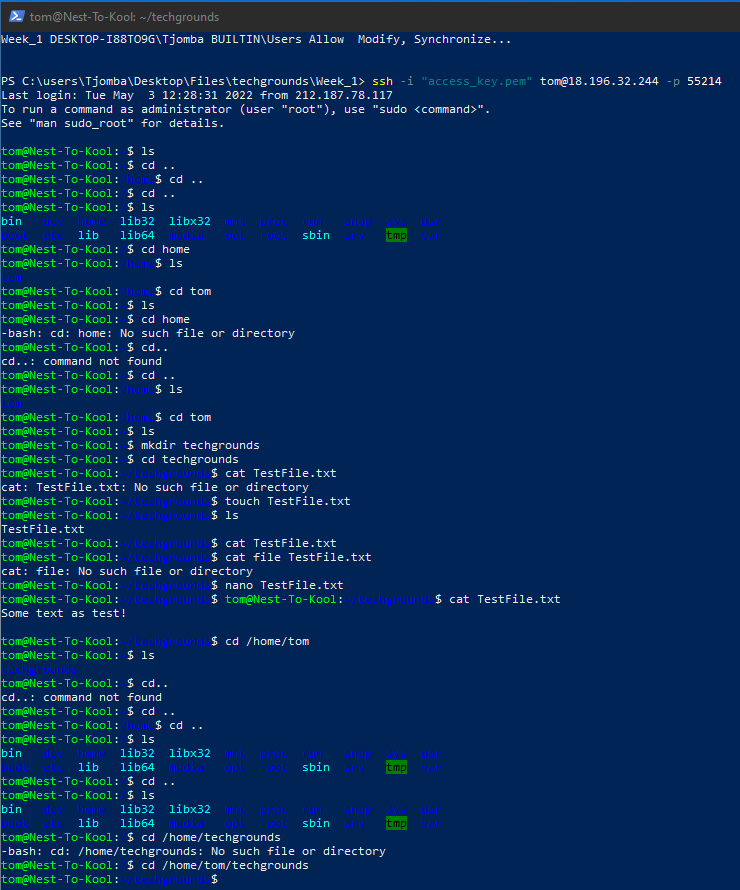

# Linux: Files and Directories
Linux uses files and folders, like you’re used to with any OS you’ve used. Navigating these files and folders are a bit different though.

## Key Terminology
- Absolute path = An absolute path is defined as by specifying the location of a file or directory from the root directory
- Relative path = Relative path is defined as the path related to the present working directly(pwd). It starts at your current directory and never starts with a /.
- Directory = A folder, is able to contain other directories or files

## Commandlines
- cd = Change directory
- mkdir = Make directory
- ls = List all directories/files in current directory
- pwd = Show present working directory
- touch = Create a new, empty file, or update the modified time of an existing one
- nano/vim "filename" = Edit file in Nano or Vim text editor
- cat "filename" = View contents of file
- rm "filename" = Remove a file

## Exercise
- List all directories in "Home"
- Make a new directory
- Create a new text file within new directory
- Move around directory using absolute and relative paths

### Sources
https://linuxconfig.org/linux-commands-cheat-sheet

### Overcome challenges through commandlines
- Change/Make Directory
- Edit/Make a text file
- Navigate with both relative and absolute paths

### Results

