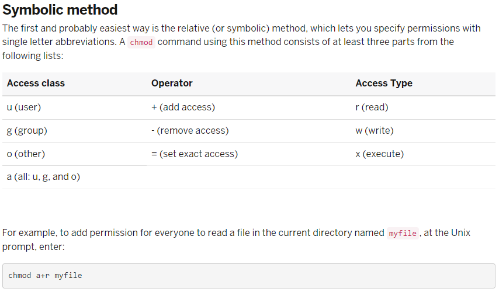
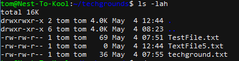
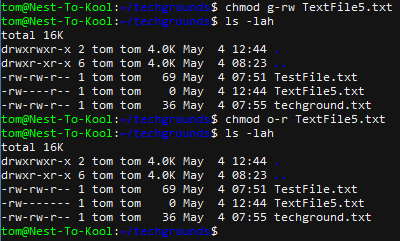
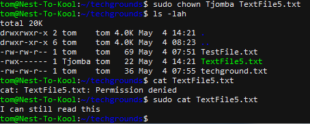
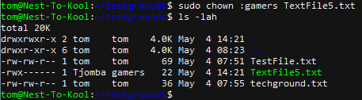

# File Permissions

## Key Commandlines
- ls -lah = Use this command to view the permissions for all files in a directory
- chmod = (change mode)Use this command to change permissions

- chown "user" = (change owner)Use this command to change owner
- chown :"group" = Use this command to change group

## Key terminology
- Permissions:
  - D: Indicates if the item is a directory. If "-" then the file is a text file.
  - R: Read permission granted
  - W: Write permission granted
  - X: Execute permission granted

- Permissions are divided into 3 groups with the initial character indicating file type: - RWX --- ---
    - First set is the owners permissions
    - Second set is the groups permissions
    - Third set is for the "world" or other users, outside group

## Exercise
- Create a text file and make a long listing to view the file's permission. Who's the file's owner and group?
- What permissions does this file have?
- Make this file executable
- Remove the read and write(RW) permission from everyone except the owner and see if you can still read it
- Change owner of the file to a different user and check if you can read it again
- Change group ownership of the file to different group

### Sources
https://kb.iu.edu/d/abdb#:~:text=To%20view%20the%20permissions%20for,in%20a%20directory%20in%20Unix.&text=In%20the%20output%20example%20above,a%20file%20or%20a%20directory.

https://linuxize.com/post/linux-chown-command/

### Overcome challenges
- Know how to see and modify permissions for specific files/directories

### Results
New text file = "TextFile5.txt"
File's owner is "tom" and file's group is "tom".
File's permissions are:
 - Owner can read and write(indicated by the 1st "R" and "W")
 - Group can read and write(indicated by the 2nd "R" and "W")
 - Others can read(indicated by the 3rd "R")

Permissions are changed so only the owner can **read** and **write**, indicated by "RW".

Change owner of the file to "Tjomba" and given the owner the permission to execute(indicated by the "X"). Now we can not read the file anymore, except when we use "sudo".

Changed file group to "gamers".

