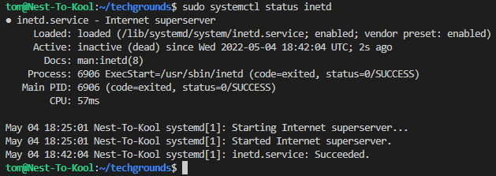

# Processes

## Key terminology
- telnet = Old network protocol
- daemon = Process that runs in the backgrounds and is non-interactive
- PID = Process ID

## Key Commandlines
- sudo apt-get install telnetd = This commandline is used to install the Telnet server
- sudo systemctl status inetd = This commandline is used to check status of "inetd"
- telnet = Use this to connect to telnet command prompt

## Exercise
- Start a telnet daemon
- Find out the PID of the telnet daemon.
- Find out how much memory telnet is using
- Stop or kill the telnetd process.

### Sources
https://itsfoss.com/linux-daemons/

https://quehow.com/how-to-install-and-use-telnet-in-ubuntu/3629.html

### Overcome challenges
- Learned to use terminal within VScode
- Learned how to install telnet on Ubuntu 22.04 LTS
- Learned how to check the status of server
- Learned how to stop daemon

### Results
- Started telnet, checked it's status.
- PID=6571
- Memory = 904.0K

- Stopped process
