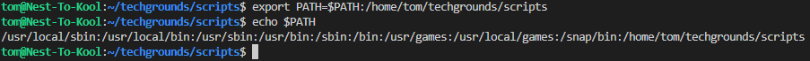
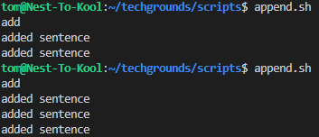
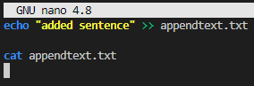
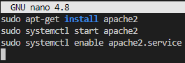
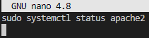
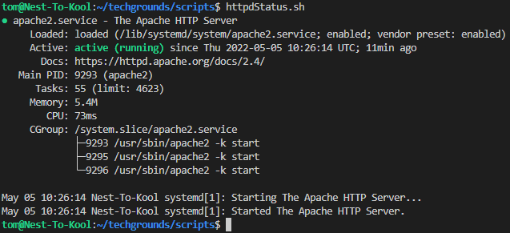
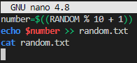
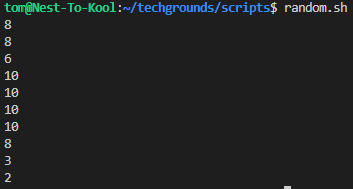
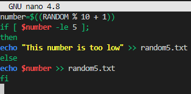
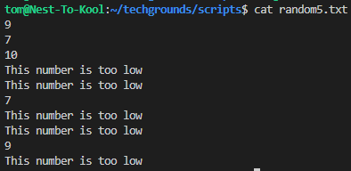

# Bash scripting
The default command line interface in Linux is called a Bash shell.
A Bash script is a series of commands written in a text file. You can execute multiple commands in a row by just executing the script.
Additional logic can be applied with the use of variables, conditions, and loops among others.

## Key terminology
- Append = add something to the end of a written document

## Key Commandlines
- ***=*** = Use this to assign a variable
- export PATH=$PATH:/some/new/path = Use this command to add paths to PATH variable
- export PATH=/some/new/path:$PATH = Use this command to set a path

## Key Scripting lines
- $((RANDOM % Y + X)) = Use this line to generate a value between Y and X
- X -ge Y = Use this to check if X is greater(g) or equal(e) to Y
- X -lt Y = Use this to check if X is less(l) or equal(e) to Y
- if["check if true"]; then = Use this to use condition and do the action after *then
- elif["if *if* is not true, check if this true"]

## Exercise 1
- Create a directory called "scripts"
- Add scripts directory to the PATH variable
- Ceate a script that appends a line of text to a text file whenever it is executed
- Create a script that installs the httpd package, activates httpd, and enables httpd.
- Finally, your script should print the status of httpd in the terminal

## Exercise 2
- Create a script that generates a random number between 1 and 10, stores it in a variable, and then appends the number to a text file.

## Exercise 3
- Create a script that generates a random number between 1 and 10, stores it in a variable, and then appends the number to a text file only if the number is bigger than 5. If the number is 5 or smaller, it should append a line of text to that same text file instead.

### Sources
https://opensource.com/article/17/6/set-path-linux

https://www.baeldung.com/linux/path-variable#:~:text=The%20PATH%20variable%20is%20an,path%20when%20running%20a%20command.

https://askubuntu.com/questions/452488/the-command-could-not-be-located-because-usr-bin-is-not-included-in-the-path

https://www.linuxjournal.com/content/how-create-shell-script-linux

https://linuxconfig.org/bash-scripting-tutorial

https://www.tecmint.com/check-apache-httpd-status-and-uptime-in-linux/

https://blog.eduonix.com/shell-scripting/generating-random-numbers-in-linux-shell-scripting/

https://linuxhint.com/generate-random-number-bash/

https://acloudguru.com/blog/engineering/conditions-in-bash-scripting-if-statements

https://devhints.io/bash

### Overcome challenges
- Learned how to add a path to PATH variable
- Learned how to make a script
- Learned how to generate a random number
- Learned how to use variables
- Learned to use conditions and their syntax

## Results
## Exercise 1
- PATH variable is added to the path to "scripts".

- Append.sh adds "added sentence" to a file called "appendtext.txt", then use "cat" command to show contents of "appendtext".

- Following script is used to install, start and enable apache2.

- Next we make a script to see if the Apache2 is running.

- After running the script to see the status on Apache2, it shows the server is running.

## Exercise 2
- Created the following script to generate a number between 1 and 10, and append to random.txt"

- After running it 10 times, the following numbers are generated.

## Exercise 3
- Using the following script to filter if the generated number is 5 or lower, appending the number if it's higher and appending the phrase "This number is too low" when the number is 5 or lower.

- After running the script 10 times, it shows the following result.

