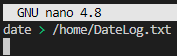
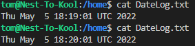
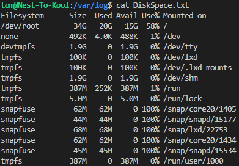

# Cron Jobs
There might be processes that you want to execute on a regular schedule. For example, you might want to write the available disk space to a log file every hour. Or maybe you want to check for system updates every 2nd day of the month.

These kinds of jobs can be automated using Cron jobs.

## Key terminology
- Cron Jobs = Processes that are automatically executed on a scheduled basis
- date = Use this to display date and time
- df = Use this to display 

## Key Commandlines
- a b c d e /"path"/Script.sh output = This is the standard form of a cron job
- a b c d e = minute(a) hour(b) day(c) month(d) day of the week(e), these values decide when the cron job is running
- crontab -e = Use this line to see all current cron jobs(and edit them if needed)

## Exercise
- Create a Bash script that writes the current date and time to a file in your home directory.
- Register the script in your crontab so that it runs every minute.
- Create a script that writes available disk space to a log file in ‘/var/logs’. Use a cron job so that it runs weekly.

### Sources
https://phoenixnap.com/kb/set-up-cron-job-linux

https://opensource.com/article/17/11/how-use-cron-linux

https://itsfoss.com/check-free-disk-space-linux/#:~:text=The%20simplest%20way%20to%20find,disk%20space%20on%20Linux%20systems.&text=With%20%2Dh%20option%2C%20it%20shows,format%20(MB%20and%20GB).

https://phoenixnap.com/kb/set-up-cron-job-linux

### Overcome challenges
- Learned how to check date and time
- Learned how to use cron jobs and edit it's variables
- Learned how to check available diskspace 

### Results
- Created the following Bash script to show the date and time to right to "DateLog.txt"

- Added the following cron job within crontab(using "crontab -e" to gain access):  * * * * * /home/tom/techgrounds/scripts/DateTime.sh
- This ensure the "DateLog.txt" gets updated with the time every minute.

- Using this script: ")
- Added the following cron job to crontab:
"0 0 * * 7 /home/tom/techgrounds/scripts/DiskSpace.sh"
- This cronjob now update the available diskspace every Sunday.

