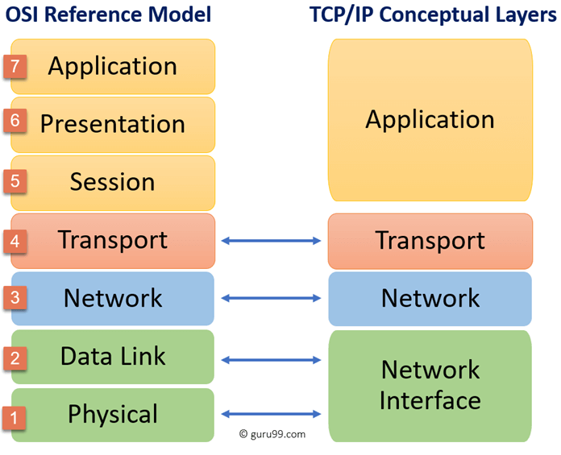
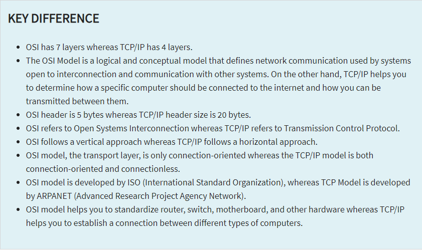

# OSI Stack
## OSI Model
The OSI model characterizes computing functions into a universal set of rules and requirements in order to support interoperability between different products and software. When you compare it to a TCP/IP model, is has more indepth layers, which makes it more useful for troubleshooting. OSI model catergorizes the communications between systems into 7 different layers:
1. **Physical:** "Physical" resources, like cables, network hubs, modems
2. **Data Link:** This layer is where node-to-node data transfer happens. The data is packaged into frames. Also, minor errors made by physical layer are corrected. Consists of two sub layers
    - Media access controll(MAC): Flow control, multiplexing for device transmissions of a network
    - Logical link control(LLC): Flow and Error control, identifies line protocols
3. **Network:** Receiving frames and delivering them, using IP(Internet Protocol), to the intended destination. Routers are crucial on this layer.
4. **Transport:** The transport layer manages the delivery and error checking of data packets. It regulates the size, sequencing, and ultimately the transfer of data between systems and hosts. Example of transport layer: TCP(Transmission Control Protocol)
5. **Session**: The session layer controls the conversations between different computers. A session or connection between machines is set up, managed, and terminate. Session layer services also include authentication and reconnections.
6. **Presentation**: The presentation layer formats or translates data for the application layer based on the syntax that the application accepts (also called the syntax layer). This layer can also handle the encryption and decryption required by the application layer.
7. **Application:** At this layer, both the end user and the application layer interact directly with the software application. This layer sees network services provided to end-user. The application layer identifies communication partners, resource availability, and synchronizes communication.

## TCP/IP Model
While the ISO model is useful for troubleshooting, it is not entirely the Within the TCP/IP model there are 4 layers:
1. **Network Access (Data Link)**: Handles physical infrastructure, like cables, wireless networks and device drivers in you computer.
2. **Internet** : Controls flow and routing of traffic to ensure data is sent speedily and accurately. Also reassembles data packet at destination.
3. **Transport:** The transport layer provides a reliable data connection between two communicating devices. It’s like sending an insured package: The transport layer divides the data in packets, acknowledges the packets it has received from the sender, and ensures that the recipient acknowledges the packets it receives.
4. **Application:** The application layer is the group of applications that let the user access the network. For most of us that means email, messaging apps, and cloud storage programs. This is what the end-user sees and interacts with when sending and receiving data.

## Key terminology
- OSI model = Open System Interconnection model
- Interoperability = Ability for a system to work with or use parts/equipment of another system.
- Node = A point in a network or diagram, where lines branch/intersect
- Multiplexing = Process where multiple different signals are combined into a single signal
- Standardize = 

## Exercise
- Find out what OSI model is and what it's used for.
- Find out what the TCP/IP model is and what it's used for

### Sources
[OSI](https://www.forcepoint.com/cyber-edu/osi-model#:~:text=The%20OSI%20Model%20(Open%20Systems,between%20different%20products%20and%20software.))

[Interoperabilty](https://www.merriam-webster.com/dictionary/interoperability)

[Multiplexing](https://www.techtarget.com/searchnetworking/definition/multiplexing)

[TCP/IP](https://www.avg.com/en/signal/what-is-tcp-ip#:~:text=There%20are%20four%20layers%20of,when%20the%20data%20is%20received.)

[Difference between models](https://www.guru99.com/difference-tcp-ip-vs-osi-model.html#:~:text=OSI%20refers%20to%20Open%20Systems,both%20connection%2Doriented%20and%20connectionless.)

### Results
For a description of the corresponding models, check the summary at the top.

Usecases:
- ISO: ISO is useful to standardize hardware(Router, switch, motherboard).
- TCP/IP: Using TCP/IP is more helpful when establashing a connection between 2 different types systems.

