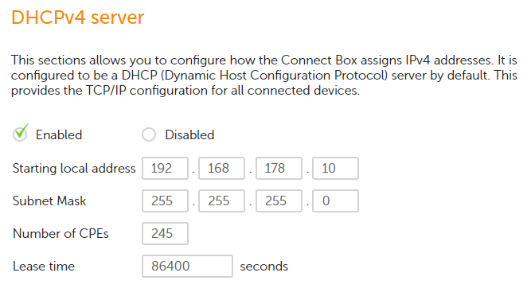

# Network Devices
To have more than 2 system connected to eachother, you need to have a network. There are some key components to make that network work. Usually a router is mandatory to make a network, but once you add functionality or size to a certain network, it becomes necessary to add certain devices like repeaters and switches.

## Key terminology
- LAN: Local Area Network
- Analog: Using signals/information represented by a continously variable physical quantity
- Digital: Using signals/information represented by series of 1's and 0's(positive or negative)
- MAC address: Media Access Control address. Hardware identifier that uniquely identifies each device on a network. Refered to as Burned-in-, Ethernet hardware-, hardware- or physical address

## Devices
- Router = A router is a device that connects two or more packet-switched networks or subnetworks
- Switch = High-speed device that receives data packets and redirects them to their destination on a LAN
- Repeaters = Device that amplifies(analog) or regenerates(digital) the signal to extend the transmission distance.
- Access point = A device, such as a router, that wireless devices can use to connect to the network
- NAT Gateway = Device used to make private networks able to connect to devices outside LAN
- Internet Gateway = 

## Exercise
- Describe the functions of common networking devices
- Get a list of all the connected devices of your router
- Check what other information the router has on the connected devices
- Locate your DHCP server on your network and check it's configurations

### Sources
[What is a router?](https://www.cloudflare.com/learning/network-layer/what-is-a-router/.)

[What is a switch?](https://www.techopedia.com/definition/2306/switch-networking#)

[What is a repeater?](https://www.pcmag.com/encyclopedia/term/repeater#)

[Connecting to your router](https://consumer.huawei.com/sa-en/support/content/en-us00728122/)

[MAC](https://bluecatnetworks.com/blog/mac-address-vs-ip-address-whats-the-difference/#:~:text=A%20Media%20Access%20Control%20address,interface%20controller%20(NIC)%20card.)

[NAT Gateway](https://docs.aws.amazon.com/vpc/latest/userguide/vpc-nat-gateway.html)

[Internet Gateway](https://www.gartner.com/en/information-technology/glossary/gateway)

### Overcome challenges
- More knowledgable about networking and the devices that are present to make that happen.
- Know how to see all the connected devices to the router

### Results
For descriptions/functions of common networking devices, see "Key Terminology" above.

- Connected to the router using a browser and the default IP that is given on the router. When opening the list of connected devices it shows te following:
    - Device name
    - MAC address
    - IP address
    - Speed(Mbps)
    - Connected to:

- The DCHP server settings:
