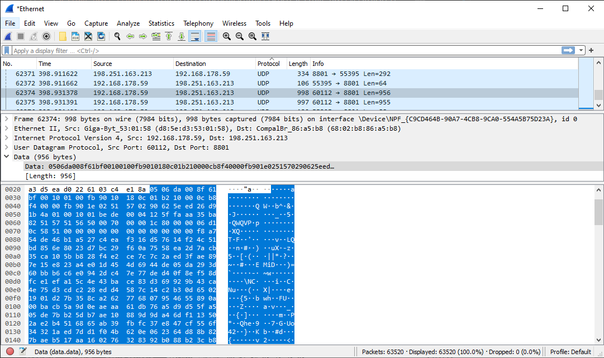

# Protocols
A network protocol is an agreement about how to communicate. There are protocols on every layer of the OSI stack. But who or what decides what protocols we use? 

## Key terminology
- IP = Internet Protocol, has task of delivering packets from source host to destination solely based on IP address.
- UDP = User Datagram Protocol, used for sending messages to other hosts on IP network
- TCP = Transmissions Control Protocol, provides reliable, ordered and error-checked delivery within IP network
- HTTPS = Hypertext Transfer Protocol Secure, extension of **HTTP**. Is used for secure communication over a network
- SSH = Secure Shell Protocol, a cryptographic network protocol for operating network services securely over an unsecured network
- IETF = Internet Engineering Task Force, open standards organisation that approves all used protocols
- Wireshark = Packet sniffer and analysis tool. Captures traffic on local network and stores the data for offline analysis.

## Exercise
- Identify several other protocols and their associated OSI layer. Name at least one for each layer.
- Figure out who determines what protocols we use and what is needed to introduce your own protocol.
- Look into wireshark and install this program. Try and capture a bit of your own network data. Search for a protocol you know and try to understand how it functions.

### Sources
[IP](https://en.wikipedia.org/wiki/Internet_Protocol)

[HTTPS](https://en.wikipedia.org/wiki/HTTPS)

[Different protocols](https://docs.oracle.com/cd/E19683-01/806-4075/ipov-10/index.html)

[Session layer Protocols](https://en.wikipedia.org/wiki/Session_layer#Protocols)

[Presentation layer Protocols](https://en.wikipedia.org/wiki/Presentation_layer)

[UDP](https://en.wikipedia.org/wiki/User_Datagram_Protocol)

[IEEE 802.3](https://en.wikipedia.org/wiki/Ethernet)

[PPP](https://en.wikipedia.org/wiki/Point-to-Point_Protocol)

[DDP](https://www.geeksforgeeks.org/datagram-delivery-protocol-ddp/)

[TCP](https://www.fortinet.com/resources/cyberglossary/tcp-ip)

[SCTP](https://en.wikipedia.org/wiki/Stream_Control_Transmission_Protocol)

[IETF](https://www.ripe.net/participate/internet-governance/internet-technical-community/ietf)

[How to use Wireshark](https://linuxhint.com/install_configure_wireshark_ubuntu/)

### Overcome challenges
- Learned about Protocols and who decides what protocols we use.
- Learned how to use Wireshark capture and analyse traffic on local network.

### Results
To show what services are being used, use the following command:
> cat /etc/protocols

Below is a list of some of the protocols, in corresponding layer.
1. Physical: **IEEE 802.3** (Institute of Electrical and Electronics Engineers
2. Data Link: **PPP**(Point-to-Point Protocol)
3. Network: **DDP** (Datagram Delivery Protocol)
4. Transport: **TCP**(Transmission Control Protocol), **SCTP**(Stream Control Transmission Protocol)
5. Session: **ADSP** (AppleTalk Data Stream Protocol)
6. Presentation: **AFP** (Apple Filing Protocol)
7. Application: **SNMP**(Simple Network Management Protocol)

- To submit your own protocols, they need to be approved by by the IETF, which is an open organisation that develops and promotes voluntary internet standards. The organisation doesn't have any formal members, but relies on volunteers. If you want a protocol to be approved, is has to be reviewed by the IETF(Internet Engineering Task Force).

- Installed Wiresharkon on local machine. Intercepted the following packet and captured the information of it.
- You can see the **Source Port** of the packet, the **destination Port**, the **protocol** that it uses and the actual data that is in the packet.

