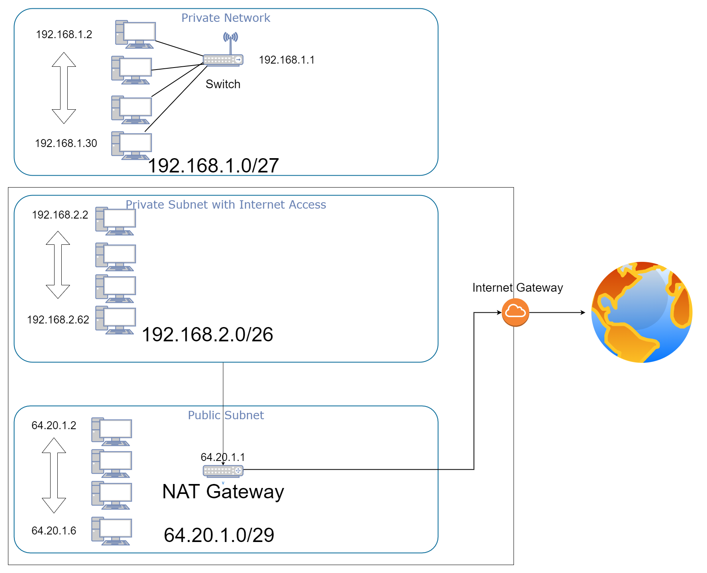

# Subnetting

## Key terminology
- CIDR = Classless Inter Domain Routing, way to notate Subnet Mask Example: 192.168.1.0/24. /24 represents the closed bits within a 32 bit IP
- Subnet Mask

## Exercise
- Make a networkarchitecture that has the following requirements:
    - 

### Sources
[Subnet Calculator](https://www.subnet-calculator.com/)

[CIDR](https://nl.wikipedia.org/wiki/Classless_Inter-Domain_Routing)

### Overcome challenges
- Pictured how a connection to a Subnet is made and what is needed
- Got familiar with Subnet Mask
- Learned how to work with diagrams

### Results

