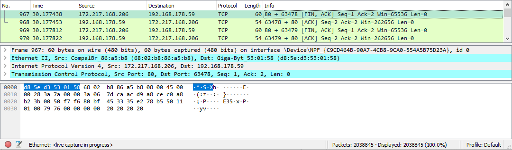

# Network Detection
The ensure you are a running a safe virtual environment, you need to be able to analyse the connections made. Wireshark is a tool that can be used to analyse on the connections that are being made by your machine.

## Key terminology

## Excercise
- Scan the network of your Linux machine using nmap and show your findings.
- Open wireshark in your local machine. Analyse what happens when you open an internet browser.

### Sources
[Install nmap](https://phoenixnap.com/kb/how-to-install-nmap-ubuntu-18-04)

[How to use Nmap](https://www.varonis.com/blog/nmap-commands)

### Overcome challenges
- Know how to use nmap to analyse ports and see the services that use them

### Results
- Installed **nmap** and used the following command to check a few ports and see what the state is and what service is used.
> sudo nmap 18.196.32.244 -Pn

- Opened a browser and analysed using wireshark. Wireshark shows the ports that are used to send/receive packets, the IP's that are used and what protocol is used for the packets.

