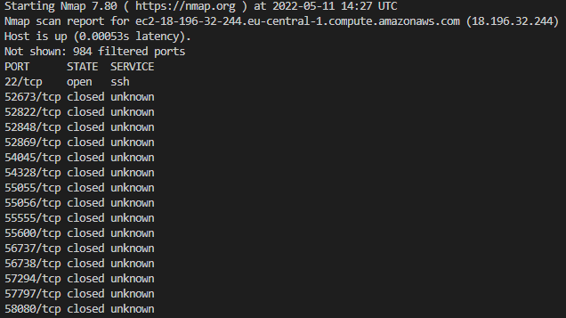

# Network Detection

## Key terminology

## Excercise
- Scan the network of your Linux machine using nmap and show your findings.
- Open wireshark in your local machine. Analyse what happens when you open an internet browser.

### Sources
[Install nmap](https://phoenixnap.com/kb/how-to-install-nmap-ubuntu-18-04)

### Overcome challenges

### Results
- Installed **nmap** and used the following command to check a few ports and see what the state is and what service is used.
> sudo nmap 18.196.32.244 -Pn

