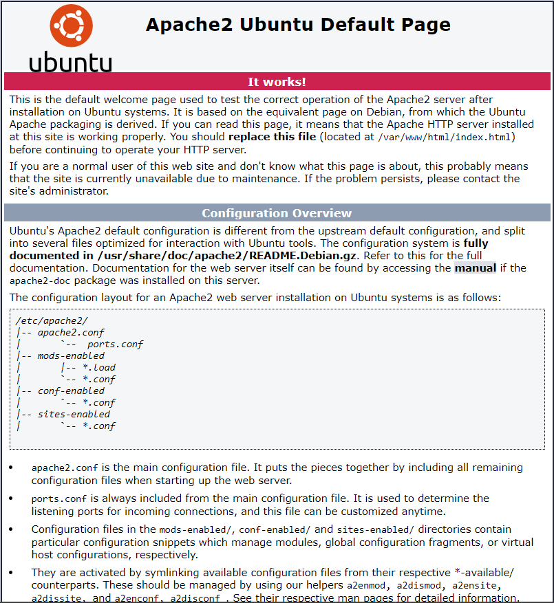

# Firewalls
Most of the Linux distro’s ship with default firewall tools that can be used to configure them. This can ensure that your system is protected against malevolent traffic.

## Key terminology
- Firewall = Is a network security system that filters and controls the traffic on a predetermined set of rules
- Chains: Rules used to process traffis
    - Input chains = All incoming traffic needs to go through these rules
    - Output chains = All Outgoing traffic needs to go throush these rules
    - Forward chains = All traffic coming from external sources and going to different external sources need to follow these rules
- Chains policies:
    - Accept = Allow traffic
    - Drop = Blocks traffic
    - Reject = When traffic fails to obey rules, the sender of traffic gets notified that is has failed

## Exercise
- Install a webserver on your VM
- Reach the standardpage of the webserver that is installed
- Configure the Firewall, so that it blocks webtraffic, but allows SSH-traffic
- Show that the firewall works

### Sources
[Configuring Firewall on Linux](https://www.geeksforgeeks.org/how-to-setup-firewall-in-linux/)

### Overcome challenges
- Learned how to configure Firewall on Linux and test if it's working

### Results
- After installing, enabling and starting the Apache2 Server we can use the following command to check if it's running/active
> sudo systemctl status apache2

- Now using the IP of our SSH connection and the port provided, we can connect to the webserver using a browser on the local machine.

- Using iptables we can see and configure the current rules for traffic. Using the following command, the current rules are shown.
> sudo iptables -L
- 