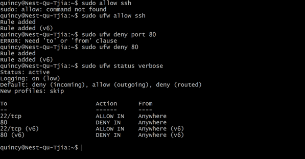

# Firewalls
Most of the Linux distro’s ship with default firewall tools that can be used to configure them. This can ensure that your system is protected against malevolent traffic.

## Key terminology
- Firewall = Is a network security system that filters and controls the traffic on a predetermined set of rules
- UFW = The default tool for linux to configure  the firewall
- Firewalls:
    - Stateful = Capable of monitoring and detecting states of all traffic on a network to track and defend based on traffic patterns and flows
    - Stateless = Focusses on individual packets, using preset rules to filter traffic
    - Hardware = Runs on it's own physical device
    - Software = Installed on another machine, like the firewall that comes with an operating system

## Exercise
- Install a webserver on your VM
- Reach the standardpage of the webserver that is installed
- Configure the Firewall, so that it blocks webtraffic, but allows SSH-traffic
- Show that the firewall works

### Sources
[Configuring Firewall on Linux](https://www.transip.nl/knowledgebase/artikel/1937-uncomplicated-firewall-ufw-in-ubuntu/)

[How to install Apache2?](https://ubuntu.com/tutorials/install-and-configure-apache#1-overview)

[How to use UFW?](https://www.digitalocean.com/community/tutorials/how-to-set-up-a-firewall-with-ufw-on-ubuntu-20-04)

[Stateful vs Stateless](https://www.cdw.com/content/cdw/en/articles/security/stateful-versus-stateless-firewalls.html)

[Hardware vs Software](https://www.checkpoint.com/cyber-hub/network-security/what-is-firewall/what-is-a-hardware-firewall/)
### Overcome challenges
- Learned how to configure Firewall on Linux and test if it's working

### Results
- After installing, enabling and starting the Apache2 Server we can use the following command to check if it's running/active
> sudo systemctl status apache2

- Now using the IP of our SSH connection and the port provided, we can connect to the webserver using a browser on the local machine.

- Using **uwf** we can configure the current rules for traffic. Using the following command, this service gets enabled.
> sudo ufw enable
- Using the following command to enable logging, this helps with troubleshooting in case it is needed.
> sudo ufw logging on

- Using the following command, a **SSH** is allowed to connect.
> sudo ufw allow ssh

- Using the following command, connection through port 80 is denied.
> sudo ufw deny 80

- Using the next command, it shows the added rules and status of the firewall.
> sudo ufw status verbose

- When trying to connect to the webserver, the connection can not be made, so the firewall works.