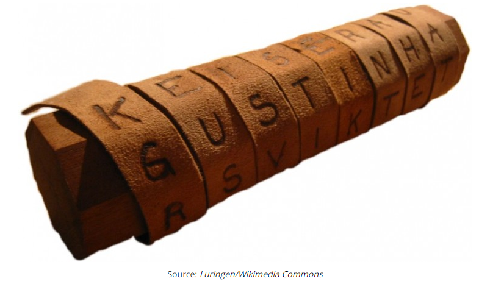
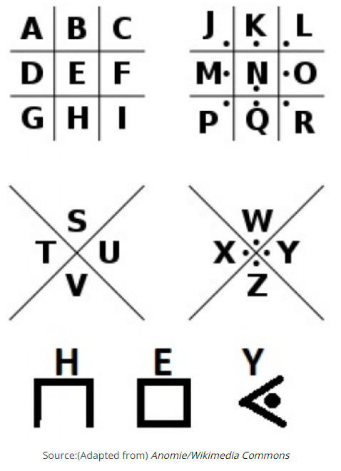
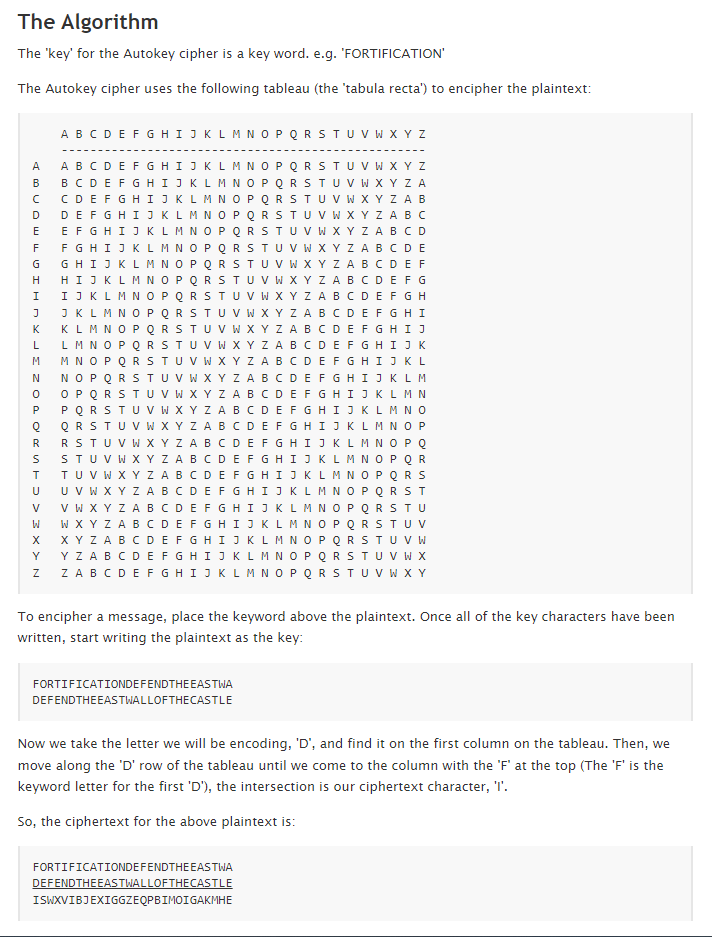
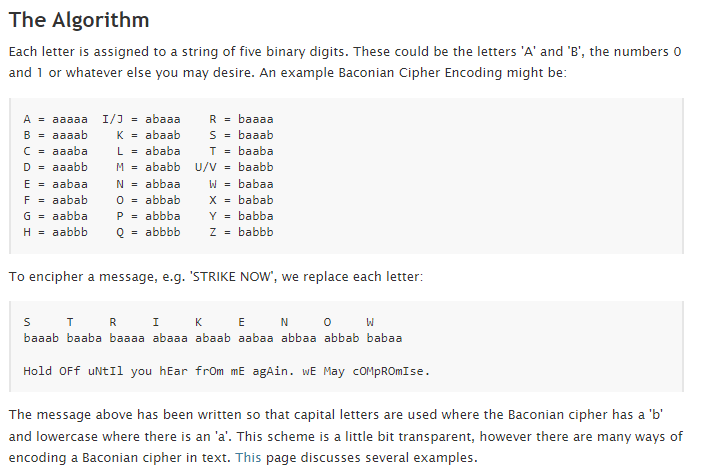

# Symmetric Encryption
Encryption is an important tool for securing data. Be it data at rest, or data in motion. A lot of what you do on your computer and the Internet is encrypted.

Throughout history humanity has come up with many ciphers to encode information. Most of these are symmetric ciphers, the most famous one being the Caesar cipher.

## Key terminology
- Cipher = A system of writing that prevents most people from understanding the message
- Encryption = Altering a message with a certain algorithm
- Symmetric encryption = A way of encryption, where the **key** to decrypting and encrypting is the same for both the sender and the reciever of the message

## Exercise
- Find two more historic ciphers besides the Caesar cipher
- Find two digital ciphers that are being used today
- Send a symmetrically encrypted message to one of your peers via the public Slack channel. They should be able to decrypt the message using a key you share with them. Try to think of a way to share this encryption key without revealing it to everyone. 
You are not allowed to use any private messages or other communication channels besides Slack. Analyse the shortcomings of this method.

### Sources
[Cipher definition](https://dictionary.cambridge.org/dictionary/english/cipher)

[Historical Ciphers](https://interestingengineering.com/11-cryptographic-methods-that-marked-history-from-the-caesar-cipher-to-enigma-code-and-beyond)

[Autokey](http://practicalcryptography.com/ciphers/classical-era/autokey/)

[Baconian](http://practicalcryptography.com/ciphers/classical-era/baconian/)

### Overcome challenges
- Learned about Ciphers and what we can learn from that nowadays
- Learned what the shortcomings of symmetric encryption are

### Results
- A few historical ciphers:
    - Scytale: Involved using a piece of parchment with a message and a rod with specific dimension, around which one would wrap the parchment, to reveal the message. Due to it's simplicity is was also not very secure.
    
    - Pigpen: This was a geometric simple substitution cipher. It used symbols to encode the letters in a message.
    

- A few digital ciphers:
    - Autokey:

    - Baconian:

- The shortcomings of trying to make an encrypted message, using a symmetric key are(among others):
    - There's no way to send something to someone in private, so all the information that is sent to the person via a public route, is visible to anyone that would be interested in that message. And because all the information to decrypt the supposedly encrypted message, is also shared through the same route, it effectively means there's no reason to encrypt the message in the first place.