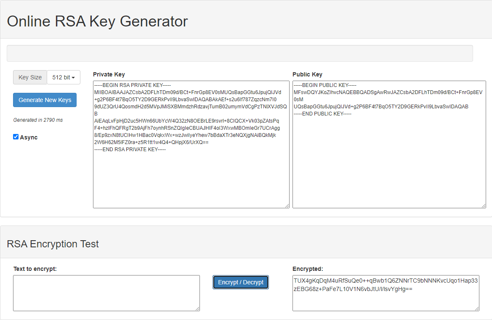
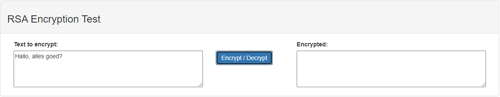

# Asymmetric Encryption
While sharing the key to an encrypted message in a public channel of some sorts, ensures that the recipient can decrypt the message, it also allows everyone else to use that key to decrypt that message. So how would you go about encrypting a message, so only the recipient is allowed to read the message.

## Key terminology
- Key pair = Set of public and private keys, that enable decryption and/or encryption:
    - The Public Key is shared with the sender of the message, which is only used to encrypt the message.
    - The private Key is not shared, and used to decrypt a messages(encrypted by the paired public key).

## Exercise
- Make a key Pair
- Use a public channel to send a message and key to 1 of your peers and make sure noone else can decrypt it.

### Sources
[Key Pair Generator](https://travistidwell.com/jsencrypt/demo/)

### Overcome challenges
- Learned how to use asymmetric encrypting using **RSA Key Generator**

### Results
- In the following picture, a key pair is created. After the **Public Key** is sent to a peer in a public channel, they use that Key to encrypt a given message. Afterwards, the encrypted message is sent back over the public channel.

- Finally, the private key is used to decrypt the message and it shows the following.

