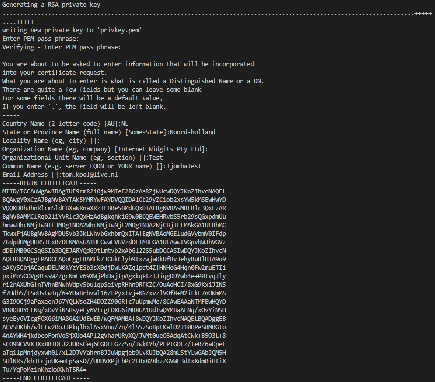
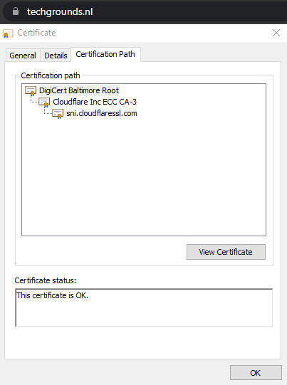
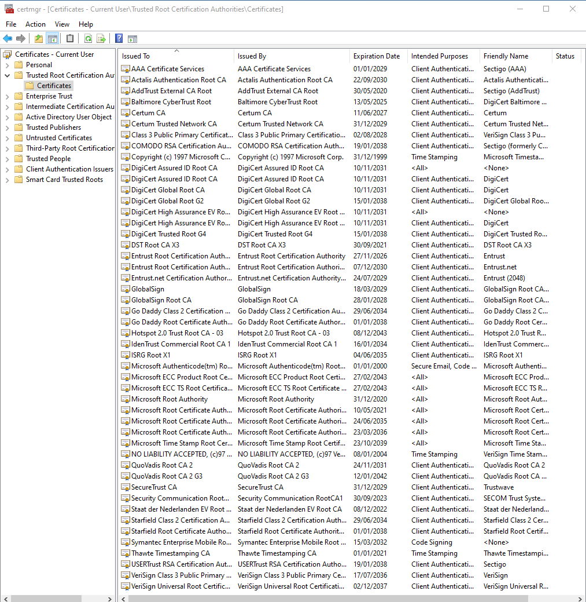

# Public Key Infrastructure
Using public-key encryption is a pretty safe way to encrypt data, but it requires a system to save all the public keys to make sure one is able to send data to a specific destination.

## Key terminology
- PKI = Public Key Infrastructure; set of roles, policies, hardware, software and procedures to create, manage, distribute, use, store and revoke digital certficates and manage public-key encryption.
- X.509 =  International Telecommunication Union (ITU) standard defining the format of public key certificates
- Passphrase = Similar to a password, but usually a longer string of words that is easy to remember
- Certification = In addition to containing the public the public key, a certification can contain additional info such as the issuer and what the certificate is supposed to be used for
- CA = Certificate authority
- Certificate Path = A collection of certificates, to extend trust from a "trust anchor"(an entity that you trust), to an "end-entity", which could be a specific site. Often times, a CA is in between.

## Exercise
- Create a self-signed certificate in your VM
- Analyze some certification paths of known websites (ex. techgrounds.nl / google.com / ing.nl)
- Find the list of trusted certificate roots on your system (bonus points if you also find it in your VM).

### Sources

[X.509](https://en.wikipedia.org/wiki/X.509)

[Creating self-signed certificate](https://linuxize.com/post/creating-a-self-signed-ssl-certificate/)

[CA](https://en.wikipedia.org/wiki/Certificate_authority)

[How to see Root certificates on Windows 10](https://docs.microsoft.com/en-us/dotnet/framework/wcf/feature-details/how-to-view-certificates-with-the-mmc-snap-in#to-view-certificates-for-the-current-user)
### Overcome challenges
- Learned how to make a self-signed certificate using **OpenSSL**
- Learned what a few key terms are regarding this subject

### Results
- After installing **openSSL** the following command can be used to create a new certificate:
> openssl req -x509
- Using that command, a few more details have to be filled in to make the Key in question. They are not mandatory, but can be useful when trying to organise all the certificates. The public key is shown(combined with other info in the certification) and the private key is saved in "privkey.pem", which only the user of the command can access.

- When you open a browser, you can see the Certificate Path by pressing the "keylock" button, right next to the URL. After that, the certificate path can be displayed under the "Certification Path" tab.

- For Windows 10 the following steps are required to see the used certificates:
    1. Select **run** from start menu
    2. Typ "certmgr.msc" to start the certification manager tool
    3. After navigating to "Trusted Root Certification Authories" the following is shown:

