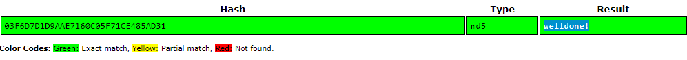
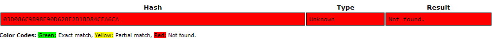

# Passwords
In terms of factors of authentication, passwords fall into the ‘something you know’ category.
On the front-end, passwords can be guessed. This can be made harder with the following strategies:
- Not using common passwords
- Using longer passwords
- Using special characters like @,*,%, etc.
- Using a mixture of CAPITAL and small letters
- Not using easily deducible passwords like birthdates or pet names
- Using a different password for every login
- Using a sentence

These are some of the useful strategies to make your passwords hard to guess, but it can also make it more difficult to remember.

To solve this issue, password managers are introduced. Using hash to transfrom a password that can be read into something that is not really readable, the passwords can be stored fairly safely. There is ways to "crack" a hashed password. Hackers use something called a "Rainbow Table".

## Key terminology
- Rainbow Table = A rainbow table is a database that is used to gain authentication by cracking the password hash. It is a precomputed dictionary of plaintext passwords and their corresponding hash values that can be used to find out what plaintext password produces a particular hash
- Salting = Adding a random sequence of approximately 32 characters to an existing password before hashing it, to make the password even more secure
- Hashing = Using a specified mathematical algorithm to turn the "plain text" password into a string of random numbers, to make it harder to decipher.

## Exercise
- Find out what hashing is and why it is preferred over symmetric encryption for storing passwords.
- Find out how a Rainbow Table can be used to crack hashed passwords.
- Below are two MD5 password hashes. One is a weak password, the other is a string of 16 randomly generated characters. Try to look up both hashes in a Rainbow Table: 
    - 03F6D7D1D9AAE7160C05F71CE485AD31
    - 03D086C9B98F90D628F2D1BD84CFA6CA
- Create a new user in Linux with the password 12345. Look up the hash in a Rainbow Table. Despite the bad password, and the fact that Linux uses common hashing algorithms, you won’t get a match in the Rainbow Table. This is because the password is salted. 
- To understand how salting works, find a peer who has the same password in /etc/shadow, and compare hashes.

### Sources
[Password salting](https://www.passcamp.com/blog/what-is-password-salting-and-why-should-you-care)

[Encryption vs Hashing](https://www.encryptionconsulting.com/education-center/encryption-vs-hashing/#:~:text=Since%20encryption%20is%20two%2Dway,salt%2C%20that%20cannot%20be%20decrypted.)

[Rainbow Table](https://www.geeksforgeeks.org/understanding-rainbow-table-attack/)

[Crackstation](https://crackstation.net/)

### Overcome challenges
- Learned the difference between encrypting vs hashing
- Learned how to use a rainbow table to crack passwords
- Understand why having a more intricate password is beneficial
- Learned about salting and it's uses

### Results
- The main difference between hashing and encrypting is that encrypting is method for a two way communication, as in, an encrypted piece of text has to be decrypted at the end again. When storing passwords, this is not necessary. It is sufficient for the password to stay "scrambled", so there's no need to decrypt it again. This in turn, make it possible to add another layer of protection, by salting the password.

- Usually, the plain text version of a password is needed to login. But when it is stored as a password hash, it is not required to know the original password, it's just the "outcome after hashing the password" that is required. To figure out the "hashed" Password, a rainbow table is used. A rainbow table is effectively a database of passwords and their matching Hash. One can use this table to see if a matching Hash is present.

- Using https://crackstation.net/ as a online rainbow table, one can simply fill in the hashed password, and the following password is as follows:

- Now with the second password, there is no matching Hash, so the Plaintext password is not stored is this database.

- Added a new user called **tom**, with password **12345**. Looking in the shadowfile, we see the following hashed password:
> $6$I/vGj.ydEfipv1/e$vKjsvrNMdRflkqf.dDyiYm79vy83VPScLx5TnxL.F9eRa1ObBXNtcXuqWqxvKSdVjKl1XZW.4Uj8EBmNixlkL1
- When trying to look for this Hash in **Crackstation**, the hash format is not recognized, presumably because the Hash was salted.

- When comparing the generated Hash password with peers, even though it is a fairly simple password and the algorithm is the same, the resulting Hash password seems to be very different from one another. This is due to the salting procedure, which presumably is different from each machine.
- The 3 different hashed passwords from "12345":
1. > $6$I/vGj.ydEfipv1/e$vKjsvrNMdRflkqf.dDyiYm79vy83VPScLx5TnxL.F9eRa1ObBXNtcXuqWqxvKSdVjKl1XZW.4Uj8EBmNixlkL1

2. > $6\$.8u.L7qbMKg9YvaS$WAtfJNKKHivIPpchi5sG.4ktHZESrK51AaSDE4f3/fZ7AU4ogcojiwBzgAHF517bEqoSa3Rnad4r6ICG.A20a0

3. > $6$C2WtNJqwtQSWuudk$p28xBZ68zqSrXAxbJZ2ju4yFJL7BEtGz6rxFfoTOMhkmZJpyNu6vLnImSAMnHycI7sJ/TnVxumsPrqzSW5stg0
