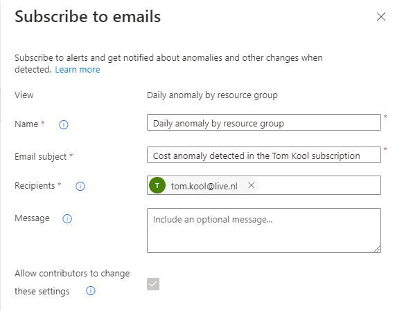
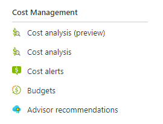

# Cost Management + Billing
A big part of Cloud-engineering is cost efficiency. So it is crucial to know what you need and what you don't. To be able to make informed decisions, one needs to be able to see what is used. Luckily, Azure has provided a few tools for this specific purpose.

## Key terminology
- **OPEX** = Operaing expense; An operating expense is an expense a business incurs through its normal business operations. Operating expenses include rent, equipment, inventory costs, marketing, payroll, insurance, step costs, and funds allocated for research and development.
- **CAPEX** = Capital expense; Capital expenses are purchases that a business makes as an investment. Capital expenditures include costs related to acquiring or upgrading tangible and intangible assets. Tangible business assets include real estate, factory equipment, computers, office furniture, and other physical capital assets. Intangible assets include intellectual property, copyrights, patents, trademarks, et. al.
- **TCO** = Total Cost of Ownership; This is an estimation of the expenses associated with purchasing, deploying, using and retiring a product or piece of equipment. Example: Buying a server has a initial purchase price, but some might need software, people to run the run(that need training), integration in an existing network etc.

## Exercise
Study the following topics:
- Azure principles of cost management
- Requirements of "Free Subscription"
- Difference between CAPEX vs OPEX
- TCO-Calculator

- Create an alert to monitor your own Cloud Pass
- Understand the options Azure provides to see the cost

### Sources
[General tips to reduce cost in Azure](https://azure.microsoft.com/en-us/overview/cost-optimization/#tools)

[OPEX and CAPEX](https://www.investopedia.com/terms/o/operating_expense.asp)

[TCO](https://www.gartner.com/en/information-technology/glossary/total-cost-of-ownership-tco)

### Overcome challenges
- Learned a few key terms regarding expenses
- Learned about cost effiency tools provided by Azure

### Results
- The difference between **OPEX** and **CAPEX**:
    - **OPEX** are recurring expenses, to keep a business running
    - **CAPEX** are investment expenses, to allow the business to grow

- To add an alert in **Azure**, navigate to "Cost management", then "Cost alerts" and add anomaly alert, so one can get a notification when an anomaly occurs.

- To see your expenses regarding the Azure environment, there's a few tools at one's disposal. Most of these can be found in the "Cost management" tab mentioned earlier.

    
- **Cost analysis** gives an overview of what the costs will be after a defined period of time.
- **Cost alerts** enables one to make alerts(as mentioned before), to make sure no unplanned expenses are being made while certain services keep running for example.
- **Budgets** allows one to set a limit to how much can be spend on services.
- **Azure Advisor** helps you optimize and reduce your overall Azure spend by identifying idle and underutilized resources. You can get cost recommendations from the Cost tab on the Advisor dashboard.
