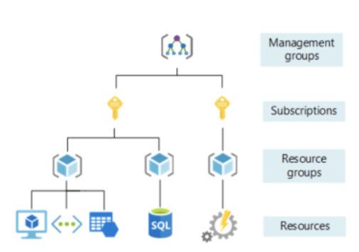
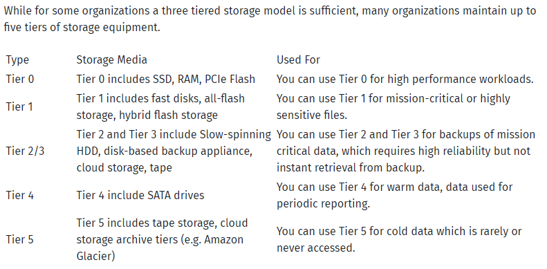

# Core services
Services provided by Azure are vast in numbers, but there are some core services, that should be studied. This can act as a guide to a AZ-900 Certification. 

## Key terminology
Few key terms regarding Azure that have not been mentioned earlier:
- **Management Groups** = These groups are containers that help you manage access, policy, and compliance for multiple subscriptions.
- **Subscriptions** = Associates user accounts and the resources that were created by those user accounts.
- **Resource Groups** = Logical collections of VM's, storage accounts, virtual networks, web apps, databases and/or database servers, assembled together for ease of managing.
- **Azure Resource Manager** = This is a management layer for your resources. Benefits of the Azure Resource Manager include the ability to manage your infrastructure through templates rather than through scripts; tagging management; deployment templates; dependency mapping; simplified role-based access control; and clarified cost management.

- **Azure App Services** = This is an HTTP-based service for hosting web applications, REST APIs, and mobile back ends. 
- **Azure Container Instances (ACI)** = Managed service that allows one to run containers directly on the Azure public cloud, without VM's.
- **Azure Kubernetes Service (AKS)** = AKS is an open source fully managed container orchestration service, can be used to deploy, scale and manage Docker containers and container-based applications in a cluster environment.
- **Azure Virtual Desktop** = A desktop that runs on a remote server. This enables you to securely access work applications and data from wherever you are and on any device.
- **Virtual Networks** = Network that can be used to run VM's and applications in the cloud.
- **VPN Gateway** = A VPN gateway is a type of networking device that connects two or more devices or networks together in a VPN infrastructure.
- **Virtual Network Peering** = Enables one to seamlessly connect two or more Virtual Networks in Azure. The virtual networks appear as one for connectivity purposes.
- **ExpressRoute** = Lets one extend your on-premises networks into the Microsoft cloud over a private connection with the help of a connectivity provider. With ExpressRoute, you can establish connections to Microsoft cloud services, such as Microsoft Azure and Microsoft 365.
- **Container (Blob) Storage** = A storage container is a defined, specific location in high-volume storage. It resembles a folder (or directory) in a computer's file system, although there are some differences in the way files are handled.
- **Storage Tiers** = Different quality levels for different types of data.

- **Cosmos DB** = Azure Cosmos DB is a fully managed NoSQL database service for modern app development. Get guaranteed single-digit millisecond response times and 99.999-percent availability, backed by SLAs, automatic and instant scalability, and open-source APIs for MongoDB and Cassandra.
- **Azure SQL Database** = Azure SQL Database is a fully managed platform as a service (PaaS) database engine that handles most of the database management functions such as upgrading, patching, backups, and monitoring without user involvement.
- **Azure Database for MySQL** = Azure Database for MySQL is a PaaS feature in Microsoft’s Azure Cloud. Basically, you get a fully functional, fully managed relational MySQL database server based on the latest MySQL Community edition. The only difference is that the server is hosted on the Azure cloud.
- **Azure Database for PostgreSQL** = Azure Database for PostgreSQL is a relational database service in the Microsoft cloud based on the PostgreSQL open source relational database.
- **SQL Managed Instance** = Azure SQL Managed Instance is a fully-managed deployment option designed to provide near-perfect compatibility for SQL migrations. You can use Azure SQL Managed Instance to lift and shift on-prem SQL apps, and then leverage unique Azure SQL features, such as linked servers, service brokers, and database mail.
- **Azure Marketplace** = The Marketplace in Microsoft Azure is similar to an online store that provides multiple applications and services developed on the public cloud of Microsoft Azure.

### Sources
[AZ-900 skills measured](https://query.prod.cms.rt.microsoft.com/cms/api/am/binary/RE3VwUY)

[Recource groups, Subscriptions, Management groups](https://www.parkmycloud.com/blog/azure-resource-groups/)

[App Service](https://docs.microsoft.com/en-us/azure/app-service/overview)

[ACI](https://cloud.netapp.com/blog/azure-cvo-blg-azure-container-instance-aci-the-basics-and-a-quick-tutorial)

[AKS](https://cloudacademy.com/blog/azure-kubernetes-service-aks-what-is-it-and-why-do-we-use-it/)

[Azure Virtual Desktop](https://www.compete366.com/blog-posts/what-is-azure-virtual-desktop-and-how-should-you-use-it/)

[Azure Virtual Network](https://www.simplilearn.com/tutorials/azure-tutorial/azure-virtual-network-vnet#what_is_azure_virtual_network)

[VPN Gateway](https://www.techopedia.com/definition/30755/vpn-gateway)

[Virtual network peering](https://docs.microsoft.com/en-us/azure/virtual-network/virtual-network-peering-overview)

[Azure Expressroute](https://docs.microsoft.com/en-us/azure/expressroute/expressroute-introduction)

[Container Storage](https://www.techtarget.com/whatis/definition/storage-container)

[Storage Tiers](https://cloudian.com/guides/data-backup/storage-tiering/#1)

[Cosmos DB](https://azure.microsoft.com/en-us/services/cosmos-db/)

[Azure SQL Database](https://docs.microsoft.com/en-us/azure/azure-sql/database/sql-database-paas-overview?view=azuresql)

[Azure database for MySQL](https://www.geeksforgeeks.org/microsoft-azure-introduction-to-azure-database-for-mysql/)

[Azure Database for PostgreSQL](https://docs.microsoft.com/en-us/azure/postgresql/single-server/overview)

[SQL Managed Instance](https://cloud.netapp.com/blog/azure-cvo-blg-azure-sql-managed-instance-explained-key-features-challenges)

[Azure Marketplace](https://www.educba.com/azure-marketplace/)