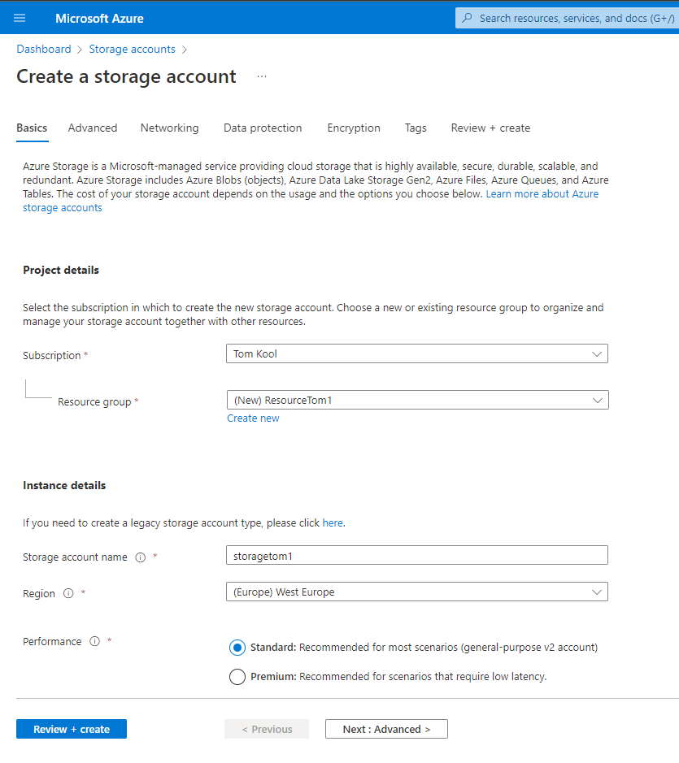
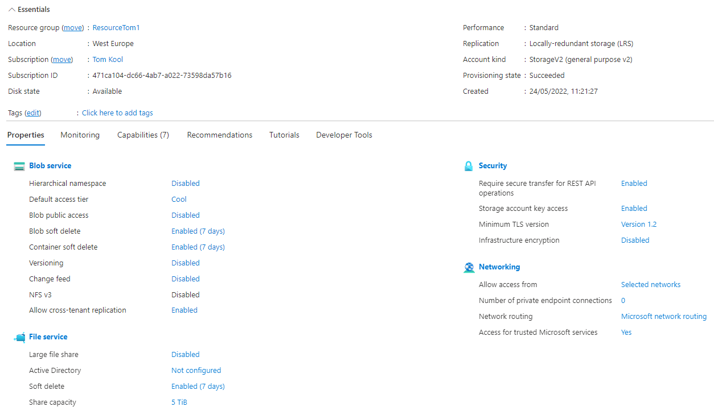
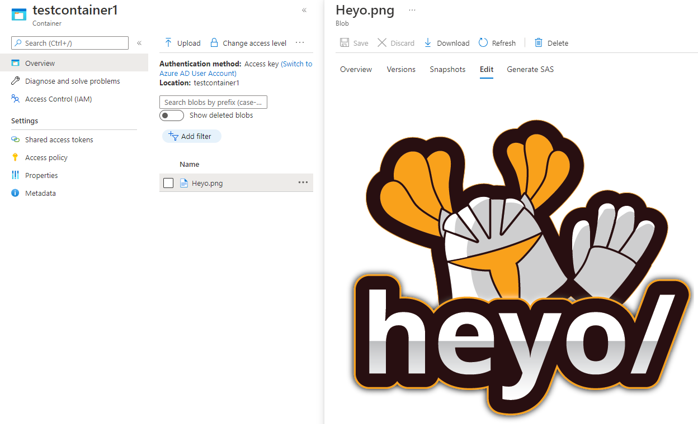

# Azure Storage Account
As the data in a Storage account can be accessed through any HTTP/HTTPS connection, it needs to have the proper permissions, so only the right entities can access the data.

## Key terminology
- **BLOB** = Binary Large Object; Type of storage that allows the storage of multimedia objects on a database.

## Exercise
- Create an Azure Storage Account. Make sure only you have access to the data.
- Place some data in a storage service of choice
- Pull data to your local machine through Azure Storage Explorer

### Sources
[Azure Portal](https://portal.azure.com/)

[BLOB](https://www.tokenex.com/blog/ab-what-is-a-blob-binary-large-object-can-it-be-tokenized)

[Youtube Tutorial](https://www.youtube.com/watch?v=M_1R0ZOlP-w)

### Overcome challenges
- Learned how to make a storage account, that is private
- Learned how to add a Container
- Learned how to upload files
- Learned how to pull files from Azure Cloud

### Results
- To make a Storage Account, one has to navigate to set tab and create a new Storage Account. A few extra pieces of info have to be given, as to give structure and security.
- When trying to make something private, it can be done on different layers. Here, we choose to make the whole storage account private, so anything put under this account is private. One can do this by navigating to the "Networking" tab and selecting how this account is accessible. 

- After creating, the following account with corresponding settings has been made.

- Afterwards, a container is created and within that container, a picture was uploaded. When given the URL to the picture, only I was allowed to see it.

- Lastly, the picture can be moved to the local machine by clicking the download button. This can also be done using the Azure Storage Explorer.