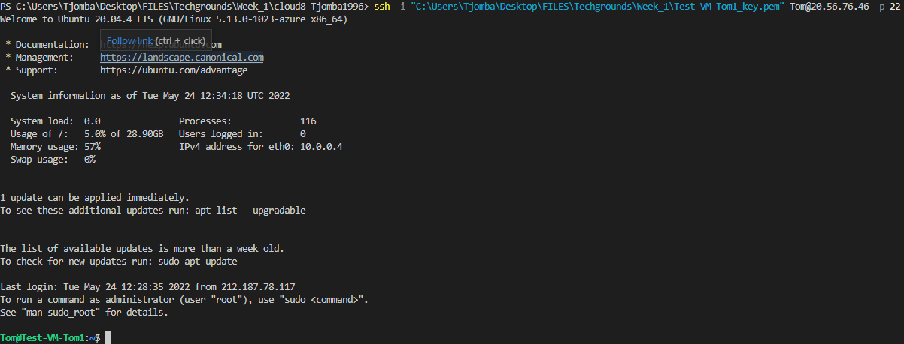

# Azure Virtual Machines
One of the key skills of a Cloud-engineer, is making and managing VM's. These Vm's can be used for a plethora of tasks, such as creating a webserver.

## Key terminology

## Exercise
- Login to Azure Console
- Create a VM with the following specs:

- The custom data should install a webserver, check if it runs

### Sources
[Azure Portal](https://portal.azure.com/)

### Overcome challenges
- Learned how to create a VM in Azure
- Learned how to automatically run scripts when creating VM's

### Results
- To create a VM, navigate to "add resources" and add the required VM. The next window should give options to adjust the settings of set VM. When going through all the settings and adjusting them accordingly we see the following:

- Now to verify if the machine is running, the following command can be used:
> ssh -i "C:\Users\Tjomba\Desktop\FILES\Techgrounds\Week_1\Test-VM-Tom2_key.pem" Tom@20.54.249.195 -p 22
- The VM itself is running, as show below:

- To check if the server that was installed through the custom data, one simply types the public IP(20.54.249.195) in the URL and it should show the default Apache2 page.

