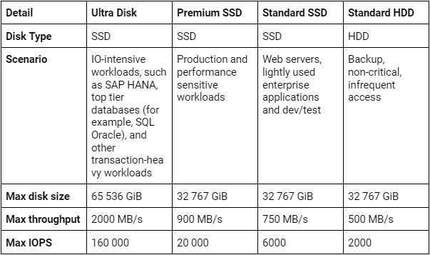
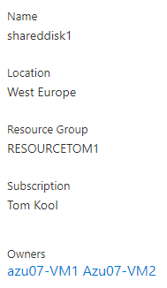
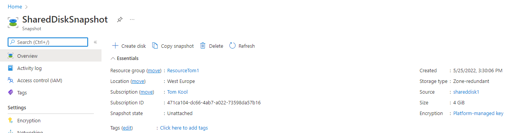
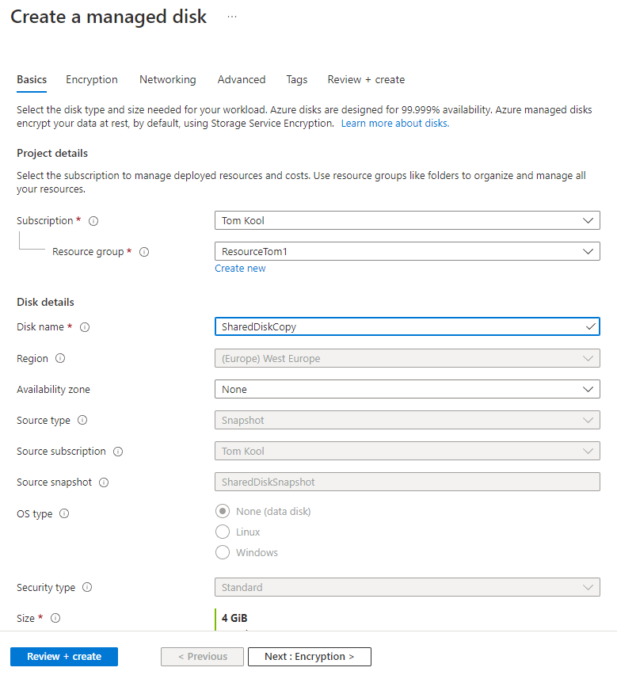

# Azure Disk Storage

## Key terminology
- **Managed Disk** = Place to store either data(Data Disk) or OS(OS Disk). Can communicate to mutiple VM's at the same time.

- **Unmanaged Disk** = Cheaper compared to a Managed Disk, but requires a Storage Account. Not able to link to multiple VM's
- **Snapshot** = A copy of the current state of memory, is case of failure. Snapshots require both on-site and off-site storage and must always be stored in the same places where the original system data is located.
- **Incremental Snapshots** = Successive copies of the data contain only that portion that has changed since the preceding full or incremental snapshot copy.
- **Mounting** = Process of "attaching" a new filesystem(like a harddrive, USB, cd-rom) to a directory in Linux, so the system can access the new filesystem.

## Exercise
- Create 2 VM's, with SSH connection
- Create Azure Managed Disk and connect to both VM's
- Make a file on 1st VM and store it on Shared Disk
- See if it is readable from 2nd machine
- Create a snapshot of the Disk and try to make a new Disk
- Mount this new Disk and look at the file

### Sources
[Snapshot vs Backup](https://simplebackups.com/blog/backups-vs-snapshots-with-differences-and-examples/)

[Incremental Snapshots](https://www.gridgain.com/docs/latest/administrators-guide/snapshots/full-incremental-snapshots)

[Mounting](https://stackoverflow.com/questions/29446836/what-does-it-mean-to-mount-a-file-system-in-linux)

[How to mount?(video)](https://www.youtube.com/watch?v=xwZfFfMTW9A)

### Overcome challenges
- Learned how to make a Disk
- Learned to make a snapshot and use this to make another Disk
- Had to see if a shared disk, shares actively. Was not able to see the file on the second machine.
- Having trouble with mounting the copied Disk to the second machine 

### Results
- Created 2 Ubuntu VM's and made sure they were running.

- Created a Managed Disk called: **SharedDisk1**. Made sure that it can be shared among atleast 2 different VM's. This has to do with the size and the typ of stored(some sizes/types don't have the option to be shared). As shown below, the disk is shared.

- Using the following command to see if the Shared Disk is visible in the VM.
> sudo fdisk -l

- To make a snapshot of Disk, one simply navigates to the Disk resource and it should show an option to make a snapshot.

- To make a new Disk using this snapshot, one can navigate to the snapshot created earlier and create a new Disk using the Snapshot as a base.

