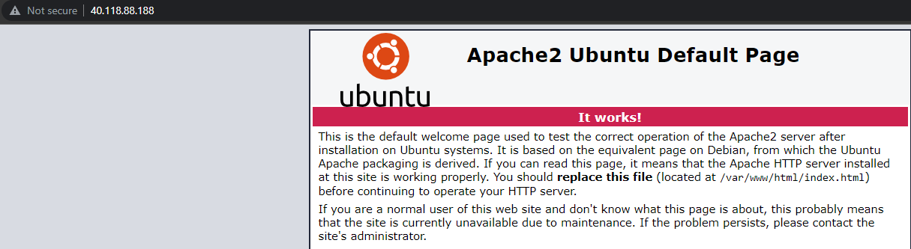

# Firewalls
Especially because everything in the cloud, can be accessed from everywhere, security is important. Learning how to make secure connections to a VM or Database is crucial to a Cloud-Engineer.

## Key terminology

## Exercise
- Create a webserver and make sure SSH and HTTP ports are open
- Create an Azure Firewall in VNET and make sure the SSH is blocked, but HTTP is still available

### Sources
[Firewall Tutorial](https://docs.microsoft.com/en-us/azure/firewall/tutorial-firewall-deploy-portal#create-a-default-route)

### Overcome challenges
- Learned how to set up an Azure firewall
- Learned how to configure Subnets, so VM can connect to a Firewall without public IP
- 

### Results
- Followed [this documentation](https://docs.microsoft.com/en-us/azure/firewall/tutorial-firewall-deploy-portal#create-a-default-route).

- Created a separate Resource Group(Test-FW-RG), VNET(Test-FW-VN), VM(Apache2-Server; that doesn't have a Public IP, or any connection like HTTP or SSH). We also made sure that the VM has been created in a Subnet(Workload-SN).

- Afterwards, we deploy an Azure Firewall(Test-FW01), gave it a Public IP(fw-pip) and configured the default subnet to "AzureFirewallSubnet".

- The idea is that all incoming and outgoing traffic goes through this Firewall, so this is the only access point with a Public IP. Now to make sure that that happens, we use a route-table and we make sure that atleast all incoming traffic is routed from all available IP's, to the Firewall and then routed to the VM that houses the Apache Webserver.

Lastly, to make sure that the connections are "filtered", we make a "NAT" rule to allow a "HTTP" connection.

**Source** = All incoming traffic.

**Destination Address** = Public IP of the Firewall.

**Destination Ports** = Port for HTTP connection, 80.

**Translated Address** = Private IP of the VM, that houses the Apache2 
server.

**Translated port** = Port for incoming traffic of the VM.

- To prove that the Firewall is working, we connect to the VM, using the Public IP of the Firewall(40.118.88.188), which routes us to the Webpage.

