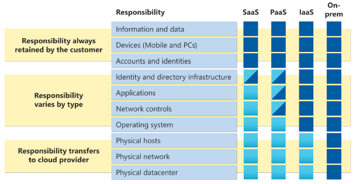

# Shared Responsibility model
When you own a datacenter, you are responsible for everthing there is to manage about that. This includes managing the data, encrypting, security, but also the building and staff that is required to make the datacenter operational. When trasitioning to the cloud, a few of the responsibilities carry over. What responsibilities carry over depends on what kind of service the "Cloud" is providing.

## Key terminology
- **SaaS** = Software as a Service; Allows users to connect to and use Cloud-based apps over the internet. Services like email, calendaring, Microsoft Office 365.
- **PaaS**= Platform as a Service; Complete development environment in the Cloud. All the resources required to develop everything from simple cloud-based apps to enterprise level applications. Example: Kubernetes.
- **IaaS** = Infrastructure as a Service; Cloud computing service that offers essential compute, storage, and networking resources on demand, on a pay-as-you-go basis. Azure is the main example here.
- **On-prem(ise)** = Everything needed is housed/installed on the location itself, instead of letting the cloud handle it.

## Exercise
- Study the Shared Responsibility model

### Sources
[What is **Saas**?](https://azure.microsoft.com/en-us/overview/what-is-saas/)

[What is **Paas**?](https://azure.microsoft.com/en-us/overview/what-is-paas/)

[What is **Iaas**?](https://azure.microsoft.com/en-us/overview/what-is-iaas/#overview)

[On Premise](https://en.wikipedia.org/wiki/On-premises_software)

[Shared Repsonsibility model](https://docs.microsoft.com/en-us/azure/security/fundamentals/shared-responsibility)

### Overcome challenges
- Learned about the difference in responsibilities between services

### Results

When looking at the Shared Responsibilty model, a few things become apparent:
- Even though the service is housed in the cloud, as a user/customer, you are always responsible for your own data, devices and passwords/account-details.
- When moving down the ladder, from "on-premise" to **Iaas**, the thing that is taken care of by the cloud, is the infrastructure. This removes the need for the customer to spend resources on housing the datacenter, ensuring it's security(by hiring security staff).
- Taking another step down, from **Iaas** to **PaaS**, the customer can relay a few additional responsibilities, though some are shared. This is in addition to the responsibilities taken over by the provider regarding infrastructure. The provider of the **Iaas** takes full responsibilty of the OS, while the customer and provider take shared responsibility over "Identity and directory infrastructure", "Applications" and "Network controls".
- Taking the last step, from **PaaS** to **SaaS**, the only thing the customer has any responsibilities over, in addition to the the previously mentioned responsibilities regarding data, devices and passwords/account-details, are the "Identity and directory infrastructure, being shared between customer and provider.  