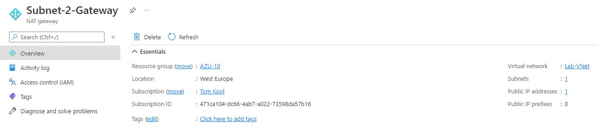
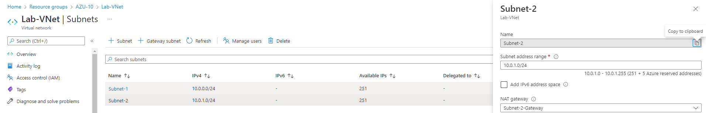
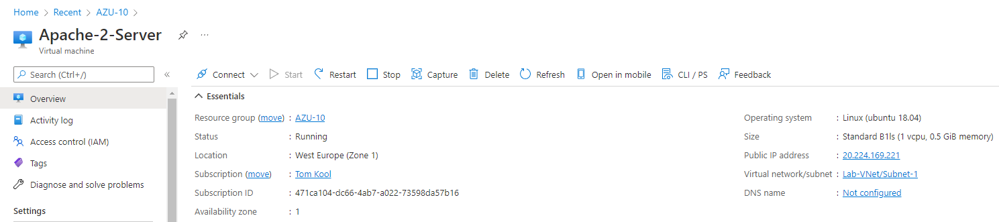
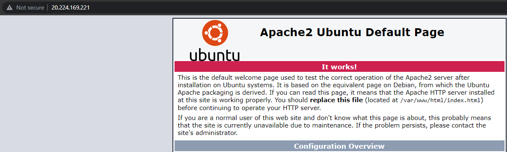

# Azure Virtual Network
VM's, Web Apps and databases need a way to communicate with eachother, users on the internet and on-prem machines. That is the responsibility of a VNet.

## Key terminology
- **VNet** = (Azure) Virtual Network; Platform to enable creating and maintaining private networks is the context of Azure Cloud and it's services.
- **VPN** = Virtual Private Network; Service that helps you stay private online. It makes a secure, encrypted connection between your computer and the internet.

## Exercise 1
- Create a VNet with the following specs:

    Region: West Europe

    Name: Lab-VNet

    IP range: 10.0.0.0/16

    - Requirements for subnet 1:

            Name: Subnet-1

            IP Range: 10.0.0.0/24

            No connection to the internet

    - Requirements for subnet 2:

            Name: Subnet-2

            IP Range: 10.0.1.0/24
## Exercise 2
- Create a VM with the following specs:

        Installed Apache2 webserver
        HTTP connection, no SSH connection
        Subnet: Subnet-2
        Public IP: enabled

### Sources
[VNet](https://www.datashieldprotect.com/blog/microsoft-azure-virtual-network)

[VPN](https://www.avast.com/c-what-is-a-vpn)

### Overcome challenges
- Learned how to configure a VNet
- Learned how to configure subnets
- Learned how to add NAT-gates to subnets

### Results

## Exercise 1
- First, a resource group(**AZU-10**) is made.

- Next, a VNet is created and the two subnets have been created as well. To make sure the 2nd subnet has access to the internet, we need to create a NAT-gateway.

- Following NAT-Gateway is created, with a Public IP to connect to the internet:

- Lastly, the NAT-Gateway is connected to the 2nd Subnet, so it has access to the internet, through the public IP of the NAT.

## Exercise 2
- Created the VM, enabled HTTP, disabled SSH and gave it a public IP to connect to the internet.

- Lastly, we use the public IP of the VM to connect to the webserver.

