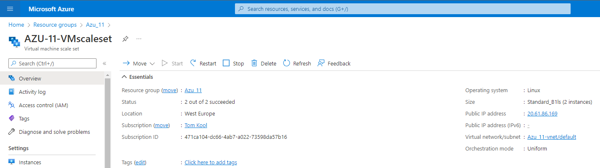
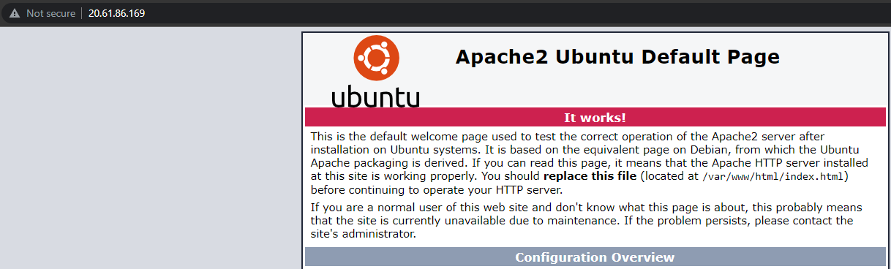
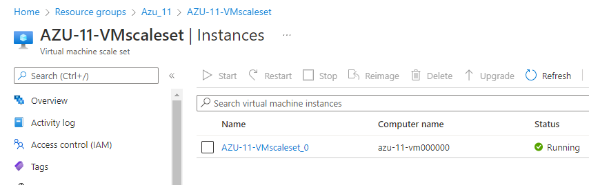
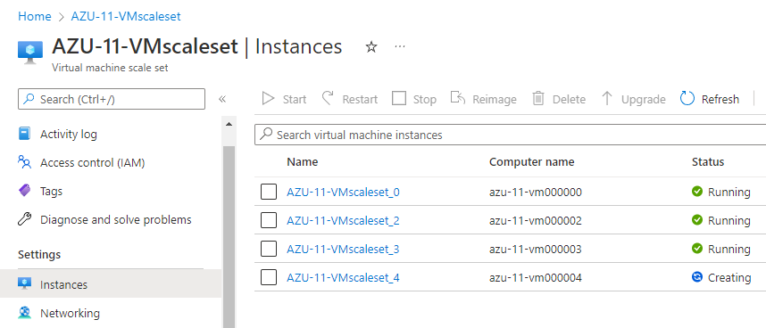

# Azure Load Balancer (ALB) & Auto scaling
One of the perks of moving to the cloud, is that one does not have to guess what capacity it's going to need. When talking about an on-demand service, you always have the options to scale up and down, due to services like **Auto Scaling**.

When dealing with a "spiky" workload, you can make use of a VM scale set. This creates additional VM's when to workload is high, and removes VM's when the workload scales down.

## Key terminology
- **Autoscaling** = Enables organizations to scale cloud services such as server capacities or virtual machines up or down automatically, based on defined situations.
- **VM scale set** = Groups of VM's within Azure that can be configured and manage as a single unit, to suite specific needs.
- **Azure Monitor** = Azure Monitor helps you maximize the availability and performance of apps and services. It delivers a comprehensive solution for collecting, analyzing, and acting on telemetry from your cloud and on-premises environments. In these specific situations, it's going to help manage and determine the amount of VM's that are required.
- **Azure Load balancer(ALB)** = Layer-4 (TCP, UDP) load balancer that provides high availability by distributing incoming traffic among healthy VMs.

## Exercise
- Create a VM Scale set using the following specs:

        Ubuntu Server 20.04 LTS - Gen1
        Size: Standard_B1ls
        Allowed inbound ports:
        SSH (22)
        HTTP (80)
        OS Disk type: Standard SSD
        Networking: defaults
        Boot diagnostics not required
        Custom data: 
	        #!/bin/bash
            sudo su
            apt update
            apt install apache2 -y
            ufw allow 'Apache'
            systemctl enable apache2
            systemctl restart apache2

        Initial Instance Count: 2
        Scaling Policy: Custom
            Number of VMs: min 1 max 4
        Add a VM at 75% CPU usage
        Delete a VM at 30% CPU usage

- See if you can reach the webserver through the endpoint of the load balancer.

- Execute a load test on your servers, to activate the auto scaling.

### Sources
[Autoscaling](https://avinetworks.com/glossary/auto-scaling/.)

[VM Scale set](https://www.techtarget.com/searchcloudcomputing/definition/Microsoft-Azure-VM-Scale-Sets)

[Azure Monitor](https://docs.microsoft.com/en-us/azure/azure-monitor/overview)

[Azure Load Balancer](https://docs.microsoft.com/en-us/azure/virtual-machines/windows/tutorial-load-balancer)

[How to add Load Balancer to VM Scale set from start to finish](https://docs.microsoft.com/en-us/azure/load-balancer/tutorial-add-lb-existing-scale-set-portal)

[Stress tester](https://linuxhint.com/useful_linux_stress_test_benchmark_cpu_perf/)

### Overcome challenges
- Learned how to set up a VM Scale set

### Results
- First of all, we make a Resource Group(Azu_11) for ease of managing. Next, we create and configure the VM Scale Set to the desired specifics, provided by the assignment. We also enable Load Balancing.

- We can access our webserver, by using the Frontend IP from the Load Balancer.

- It has 2 instances as is starts up, as expected. It checks the workload every 5 miuntes, so when the workload is low, this amount of instances drops to the minimum, which is 1.

- Now to see if the VM Scale Set is also working under a heavier load, we use a stress test to increase the amount of CPU usage. We use the following command to install a stress test:
> Sudo apt install stress
Afterwards, we run the stress test with:
> stress --cpu 18
After using this command, we seen that the VM Scale Set adds additional VM's to distribute the workload, although we specifically target this VM now. This proves that the Scale Set works.
