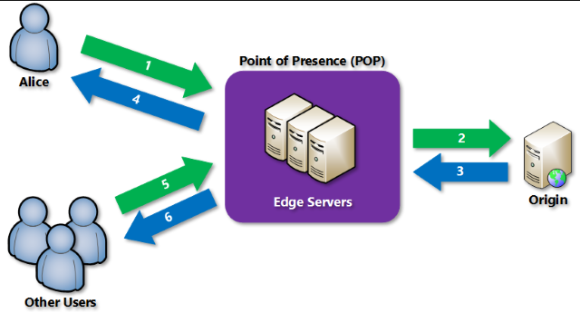

# Content Delivery Network
As cloud is included more and more, it is essential that info/data gets transported in a timely manner. There are a few "tricks" to make this transporting of data even faster.

## Key terminology
- **Caching** = Temporarily storing data, for ease of access.
- **POP** = Point of Presence; Node or network interface point between communicating entities.
- **Audience Segmentation** = A marketing strategy based on identifying subgroups within the target audience in order to deliver more tailored messaging for stronger connections.

## Exercise

### Sources
[CDN](https://docs.microsoft.com/en-us/azure/cdn/cdn-overview)

[CDN Benefits](https://www.cdnetworks.com/web-performance-blog/cdn-benefits/)

[POP definition](https://en.wikipedia.org/wiki/Point_of_presence.)

[Audience Segmentation](https://mailchimp.com/marketing-glossary/audience-segmentation/)

### Overcome challenges

### Results

## What is CDN?
This is a distributed network that can efficiently deliver web content. It does this by caching certain files on POP's, that are strategically advantageous. When dealing with dynamic content, which cannot be cached, CDN can accelerate delivery, by leveraging network optimizations, using CDN POP's.

## Why should you use CDN?
The main benefit of using a Content Delivery Networkis that the Server Load decreases, as it is not a single Server that houses the data. This means that:
- The data is "Closer", which **improves latency** and overal website speed.
- The **Bandwith used is decreased**, which makes it cheaper.
- The **Security against DDoS** attacks are improved.
- As bandwith gets cheaper, security increases and latency improves, the overall audience reach improves as well.

There's also the fact that this network can give very valuable insights, in the form of Audience Segmentation on User analytics. Especially combined with the increased audience reach, this can be a very welcome side-effect.

## Comparison
For a more detailed comparison between all the CDN providers follow [this link](https://cdncomparison.com/).

The main 2 providers for CDN are Azure's CDN and AWS's Cloudfront. Between these two there are some minor differences, like Cloudfront doesn't support "No charges for Requests", which Azure does support. Cloudfront is a bit cheaper, but all together not that different.

Some bigger changes become apparent when we compare Azure to the smaller providers. We see that the amount of POP's is very noticable. This impacts the effectiveness of the CDN, depending on your location.