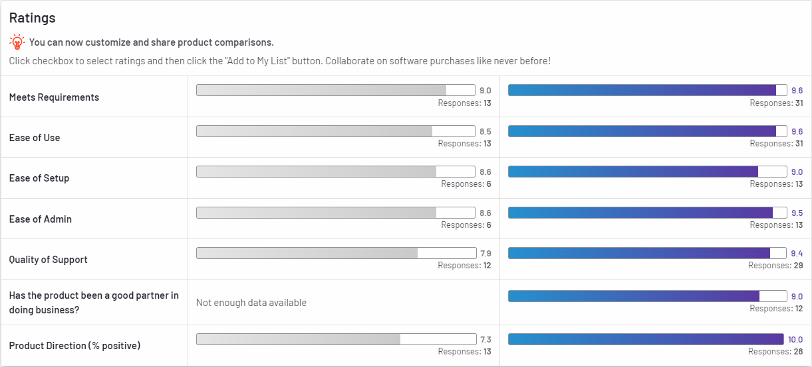

# Azure DNS
A DNS is essential in an evergrowing Internet environment. It enables user to quickly look up and resolve a requested server's location.

## Key terminology
- DNS = Domain Name System; Phonebook of the internet. DNS translates domain names to IP addresses so browsers can load Internet resources.

## Exercise
- Study Azure DNS
- Compare Azure DNS to similar solutions

### Sources
[DNS](https://www.cloudflare.com/learning/dns/what-is-dns/)

[Azure DNS Overview](https://docs.microsoft.com/en-us/azure/dns/dns-overview)

[Azure DNS VS Amazon Route 53](https://www.peerspot.com/products/comparisons/amazon-route-53_vs_azure-dns)

[Azure DNS VS Cloudflare](https://www.g2.com/compare/azure-dns-vs-cloudflare-dns)

### Overcome challenges
- Learned what Azure DNS is
- Learned key differences between Azure DNS and other solutions

### Results

## What is Azure DNS?
Azure DNS is a hosting service for DNS domains. It provides name resolution by using Microsoft Azure infrastructure. By hosting your domains in Azure, you can manage your DNS records by using the same credentials, APIs, tools, and billing as your other Azure services.

## Why should you use Azure DNS?

- **Reliability and performance:** DNS domains in Azure DNS are hosted on Azure's global network of DNS name servers. Azure DNS uses anycast networking. Each DNS query is answered by the closest available DNS server to provide fast performance and high availability for your domain.
- **Security:** Because Azure DNS is based on Azure Resource Manager, it provides a few features:
    - **Role-Based access control:** Control who has access to specific actions.
    - **Activity logs:** Monitor how users modify resources in your organisation.
    - **Resource Locking:** Ability to lock subscriptions, resource groups or resources, as to prevent accidental removal/modification of crucial resources.
- **Ease of use:** Azure DNS can manage DNS records for your Azure services and provide DNS for your external resources as well. Azure DNS is integrated in the Azure portal and uses the same credentials, support contract, and billing as your other Azure services.
- **Customizable virtual networks with private domains:** Azure DNS also supports private DNS domains. This feature allows you to use your own custom domain names in your private virtual networks.
- **Alias records:** Azure DNS supports alias record sets. You can use an alias record set to refer to an Azure resource. If the IP address of the underlying resource changes, the alias record set seamlessly updates itself during DNS resolution.

## Comparison
As Azure DNS is not the only provider for a DNS, below are some comparisons with other popular DNS providers.

- [Azure DNS VS Amazon Route 53](https://www.peerspot.com/products/comparisons/amazon-route-53_vs_azure-dns): The general concensus is: Use whatever platform you already are invested in. But when you start out fresh, the following key differences are apparent. Azure DNS does not support DNSSEC, which can be a turndown to some users. Compared to Amazon Route 53, Azure DNS has excellent operating time and performance, fast deployment time, and it's very easy to manage, due to the ability to monitor everything. Whereas Amazon Route 53 provides excellent failover services, 100% availability and all together is a very diverse, robust and very scalable solution.

- [Azure DNS VS Cloudflare](https://www.g2.com/compare/azure-dns-vs-cloudflare-dns): When comparing Azure DNS to Cloudflare DNS, Cloudflare DNS comes out on top, according to the following statistics. What is notable, is that the majority of reviews regarding Cloudflare DNS seem to be from smaller companies(50 or less employees), while Azure DNS's reviewers all distributed fairly equaly across the board. This might have to do have the integration of all microsoft's additional services, but that is not apparent in this diagram.

