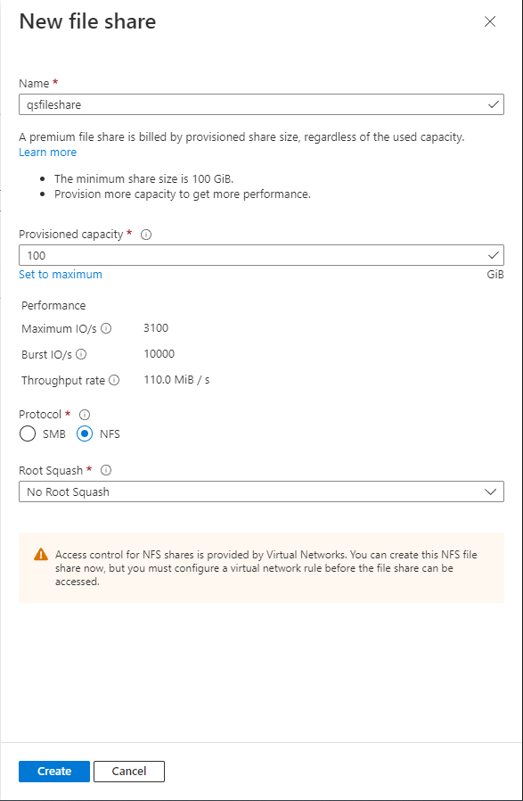
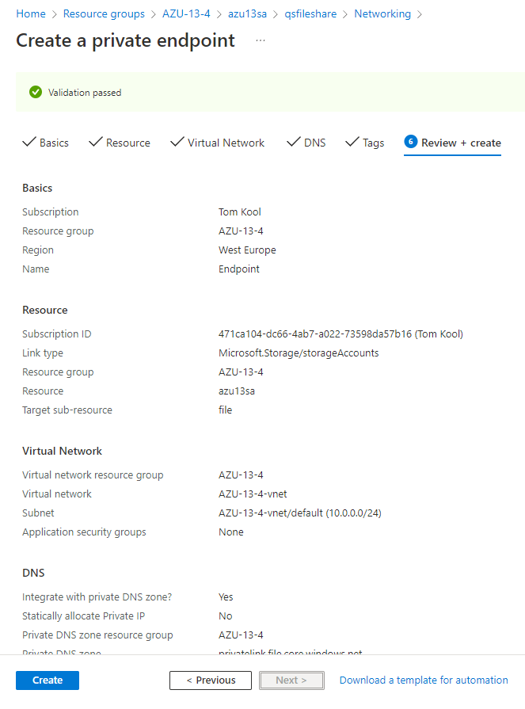

# Azure Files
One of the key benefits of the cloud is the fact that data can be accessed from multiple location/devices. How and where data is stored, can be done with different services. There are some differences however, so depending on your preference, one solution might be better than another.

## Key terminology
- SMB = Server Message Block; Protocol that allows apps on a machine to read/write to files and request services from server programs in a computer network.
- NFS = Network File System; Protocol that allows a user on a client computer to access files over a computer network much like local storage is accessed.

## Exercise
- Study Azure Files
- Know how Azure Files works
- Compare Azure Files to similar services and discover their differences

### Sources
[Azure files](https://docs.microsoft.com/en-us/azure/storage/files/storage-files-introduction)

[Tutorial: Create an NFS Azure file share and mount in linux VM](https://docs.microsoft.com/en-us/azure/storage/files/storage-files-quick-create-use-linux)

[Azure Files VS Blob](https://www.c-sharpcorner.com/article/azure-files-vs-blob-whats-the-difference/)

[Azure Files VS Azure NetApp](https://ramprasadtech.com/quick-difference-between-azure-netapp-files-and-azure-files/)

[Azure Files VS AWS Elastic File System](https://www.peerspot.com/products/comparisons/amazon-efs-elastic-file-system_vs_microsoft-azure-file-storage)

[SMB](https://docs.microsoft.com/en-us/windows-server/storage/file-server/file-server-smb-overview)

[NFS](https://en.wikipedia.org/wiki/Network_File_System)

### Overcome challenges
- Learned what Azure Files is used for
- Learned how to use Azure Files
- Learned key differences between solutions similar to Azure Files

### Results

## What is Azure Files?
Azure Files offers fully managed file shares in the cloud that are accessible via SMB or NFS. It allows you to create shareable storage, that can be accessed from different computers.

## Why should you use Azure Files?

- **Replace or supplement on-premises file servers**. This is desirable, as having cloud storage instead of on-premise storage is more flexible and cheaper.
- Azure Files makes it **easy to "lift and shift" applications** to the cloud that expect a file share to store file application or user data. This can be done in the by moving both Application and Data, or it can be done as a "hybrid" lift and shift. This involves moving the Data to the cloud, but the application stays running on-premises.
- It can **simplify cloud development**, by enabling **shared application settings**, having **diagnostics be shared** and easy to access, and the **process of troubleshooting is improved**, as sharing data is easier to do to multiple VM's/machines.
- Azure file shares can be used as persistent volumes for stateful containers. This means that **containers/file shares can be used on everything**, once they are created. This will accelerate development.

Summarising, using Azure files improves **flexibility, speed and monitorisation**, which will improve numerous aspects during development.

## Comparison
There are a few different solutions to the issue that Azure Files solves. The most pressing differences will be layed out here.
- [Azure Files VS Blob:](https://www.c-sharpcorner.com/article/azure-files-vs-blob-whats-the-difference/) In summary, the difference between the two storage services is that Azure Blob Storage is a store for objects capable of storing large amounts of unstructured data. On the other hand, Azure File Storage is a distributed, cloud-based file system. Azure Blob Storage would be an ideal choice for storing an enormous amount of data inexpensively, while Azure File Storage would be suitable for lift-and-shift activities.

- [Azure Files VS Azure NetApp Files:](https://ramprasadtech.com/quick-difference-between-azure-netapp-files-and-azure-files/) Alongside a few compatibility and usability differences, Azure NetApp Files is mainly a solution of a larger scale. This is apparant in the following aspects:
    - Minimum/maximum deployment size: 4TB/100TB compared to the 100GB/100TB of Azure Files
    - Max file size = 16TB compared to Azure Files' 1TB

- [Azure Files VS AWS Elastic File System:](https://www.peerspot.com/products/comparisons/amazon-efs-elastic-file-system_vs_microsoft-azure-file-storage) While Elastic File System has an easier setup, larger max storage and a more consistent latency, Azure Files provides better overall integration, high availability and more possibilities for connectivity.

## How do you use Azure Files?
Followed [this link](https://docs.microsoft.com/en-us/azure/storage/files/storage-files-quick-create-use-linux), to practise basic understanding as how to  Azure Files works.

- First, we create a [Storage Account](../../00_includes/05_Azure/AZU-13/AZU-13.4/SS_Storage_Account.png) in the premium performance tier and have File Share enabled.

- Next, we a create [Virtual Machine](../../00_includes/05_Azure/AZU-13/AZU-13.4/SS_VM.png).

- After that, we can create a File Share. We make sure that we select the NFS protocol.

- Next step is making a private endpoint within our Storage Account. This will give our storage account a private IP. Also, we disable "secure transfer", as NFS protocol doesn't support encryption, but relies on Network-level security.

- After connecting to the VM through our terminal, we mount the file share, by running a few commands provided under the File Share.
>sudo apt-get -y update

>sudo apt-get install nfs-common

>sudo mkdir -p /mount/azu13sa/qsfileshare

>sudo mount -t nfs azu13sa.file.core.windows.net:/azu13sa/qsfileshare /mount/azu13sa/qsfileshare -o vers=4,minorversion=1,sec=sys

- After these steps, we are able to navigate to the File Share, within our VM, and add/remove anything desired.