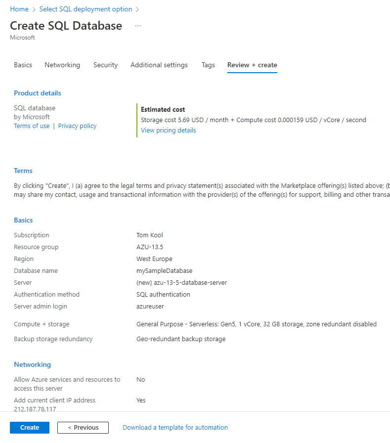
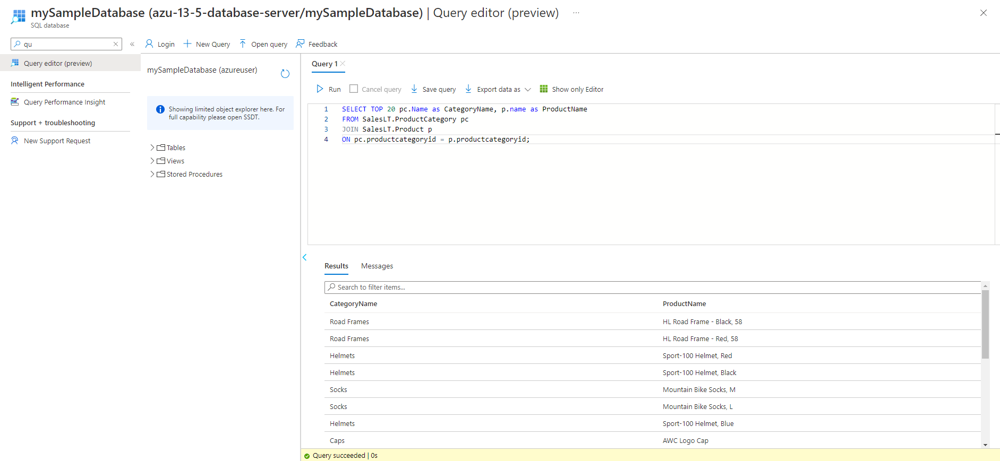

# Azure Database & Managed Instance
When talking about databases there are two main categories. There's relational and non-relational. Both can have their benefits and shortcomings. Deciding on what typ of database you want is going to depend on your needs. Relational databases are going to be the main focus here.

## Key terminology
- Relational Database = A relational database organizes data into tables which can be linked—or related—based on data common to each. This capability enables you to retrieve an entirely new table from data in one or more tables with a single query.
- Non-relational Database = Non-relational databases (often called NoSQL databases) are different from traditional relational databases in that they store their data in a non-tabular form. Instead, non-relational databases might be based on data structures like documents.
- Query = A request for data or information from a database table or combination of tables.
- SQL = Structured Query Language; This lets you access/manipulate databases, so required data can be "filtered".

## Exercise
- Study Azure Database
- Compare Azure Database to "old" solutions and similar services
- Become familiar with using Azure Database

### Sources
[Azure Database Overview](https://docs.microsoft.com/en-us/azure/azure-sql/database/sql-database-paas-overview?view=azuresql)

[Quickstart: Create Azure SQL Database](https://docs.microsoft.com/en-us/azure/azure-sql/database/single-database-create-quickstart?view=azuresql&tabs=azure-portal)

[Relational- and non-Relational Database](https://www.ibm.com/cloud/learn/relational-databases)

[Different Databases(youtube)](https://www.youtube.com/watch?v=W2Z7fbCLSTw
)

[Query](https://www.techopedia.com/definition/5736/query)

[SQL](https://www.w3schools.com/sql/sql_intro.asp)

### Overcome challenges
- Learned how to create an Azure Database in the Azure portal
- Learned about key features and differences between multiple similar services

### Results

## What is Azure Database?
As mentioned in the summary, there are two main categories in databases. Azure provides a variety of different databases, but most, if not all, are based on SQL. Azure SQL enables the user to process both relational and non-relational structures.

Azure Database 
## Why should you use Azure Database/Azure SQL?
One of the key benefits of using Azure Database is that is belongs to a family of services, all under Azure SQL. This includes 4 different types of SQL Databases, Azure SQL Managed Instance and SQL Server on Azure VM's. This promotes a very broad toolbox, to tackle the issue of organizing and using a SQL Database.

## Comparison
[This video](https://www.youtube.com/watch?v=W2Z7fbCLSTw
) will explain the different kinds of Databases, as there are quite a few to choose from. We will be comparing the more similar solutions to Azure Databases. 

## How do you use Azure Database?
To demonstrate how to use an Azure SQL Database, we use [this tutorial](https://docs.microsoft.com/en-us/azure/azure-sql/database/single-database-create-quickstart?view=azuresql&tabs=azure-portal).

First, we create a database using the Azure portal and a [SQL server](../../00_includes/05_Azure/AZU-13/AZU-13.5/SS_SQL_Server.png). In this example, Azure can provide us with a sample database, so we have something that we can test on.

- Next, we can try some simple query's(provided by the tutorial mentioned above) in Query Editor. We use the following query:

        SELECT TOP 20 pc.Name as CategoryName, p.name as ProductName
        FROM SalesLT.ProductCategory pc
        JOIN SalesLT.Product p
        ON pc.productcategoryid = p.productcategoryid;

- There are a few different ways to insert a query, and a great number of ways to use a query, but for now this will suffice to show how to set up a SQL Database.