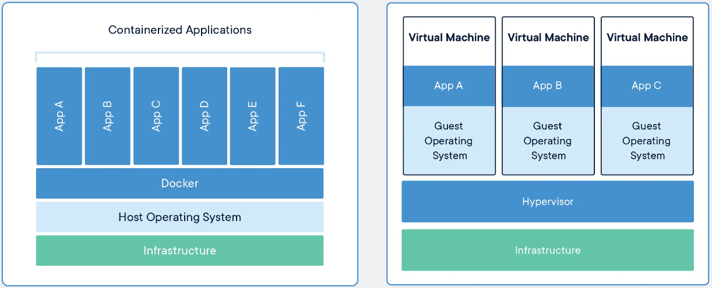

# Containers
While moving to the cloud initially, can be a tasking job to facilitate, once in the cloud there are some options that make transitioning from one environment to another quite easy.

## Key terminology
- **ACI** = Azure Container Instances; 
- **AKS** = Azure Kubernetes Service; Orchestration software to help how/where containers run

## Exercise
- Study Azure Containers

### Sources
[What is a container?](https://azure.microsoft.com/en-in/overview/what-is-a-container/)

[Azure Container](https://www.techtarget.com/searchcloudcomputing/definition/Azure-Container-Instances)

[Azure Container VS Docker](https://blog.iron.io/azure-containers-vs-docker-whats-the-difference/)

[Kubernetes](https://kubernetes.io/docs/concepts/overview/what-is-kubernetes/)

### Overcome challenges
- Got a better understanding on Containers
- Learned about Kubernetes

### Results

## **What are containers?**
A standard package of software bundles an application’s code together with the related configuration files and libraries and with the dependencies required for the app to run. Azure Container enables the use of containers in Azure public cloud without having to manage the underlying infrastructure.

## **Why should you use containers?**
When trying to relocate applications, often times issues arise as not every crucial part of the application are moved with it. Azure Containers solve a lot of these issues. By having all crucial data, applications and all things necessary in a package. This will allow you to deploy the application much easier.

## **Comparison**

### **Virtual Machines VS Containers**
When talking about virtualisation, Virtual Machines are often times the first thing that comes to mind. As containers and VM's are quite similar, it is crucial to understand what the difference is.

The main difference is that an individual VM virtualises the underlying hardware so that multiple operating system instances can run on the hardware. A container takes one more step, as it also virtualises the underlying OS and causes the containerised app to perceive that it has the OS(including CPU, memory, file storage and network connections) all to itself. This makes it so you don't need to install an OS on a container, which enables containers to be much more efficient and lightweight. Though it is portable, you have to keep in mind that the underlying OS has to be compatible. This is one of the drawbacks.

### **ACI VS AKS**
This is not so much a comparison, in which you should pick one over the other. These two services seems to work well together. While ACI can be used for containerization, Azure Kubernetes Service allows you to easily automate this process. It helps with networking, load-balancing, security, and scaling across all Kubernetes nodes which runs your containers.
