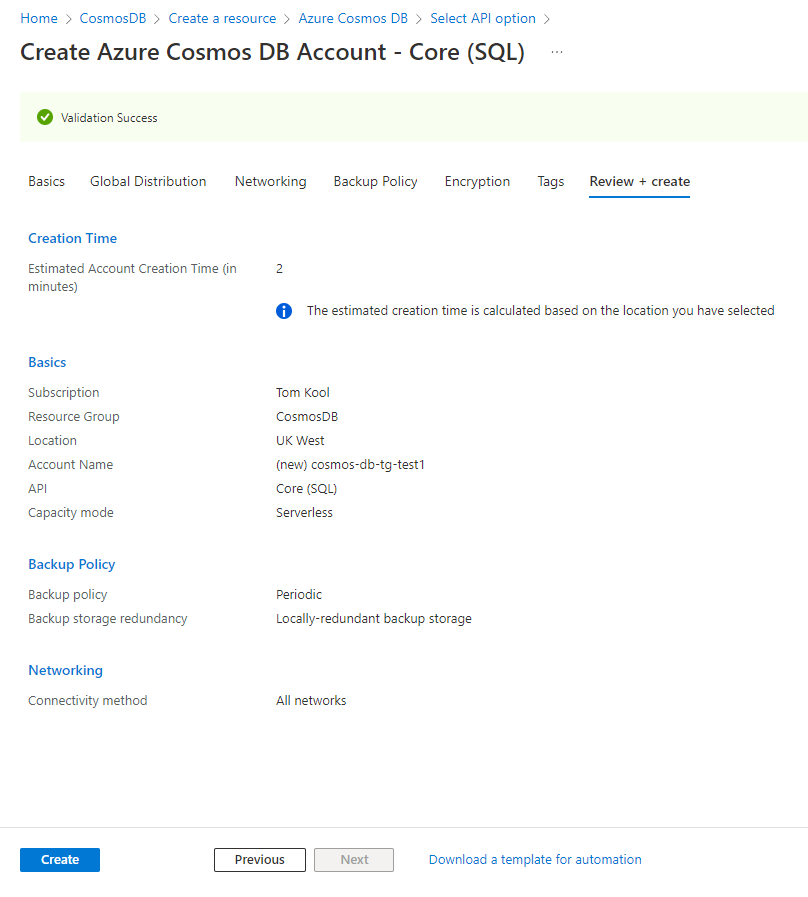
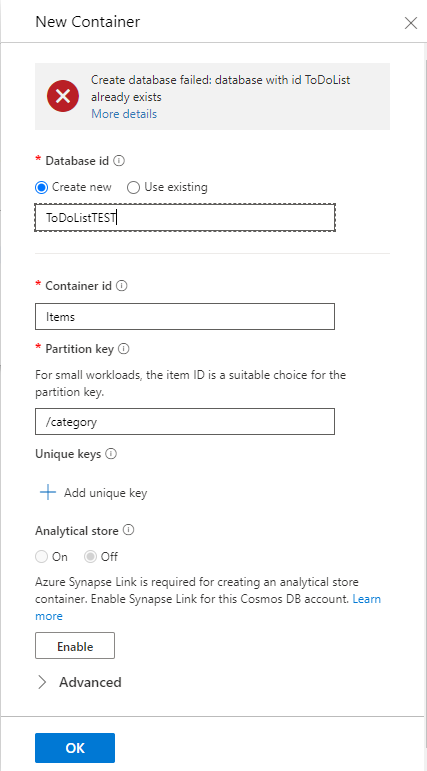
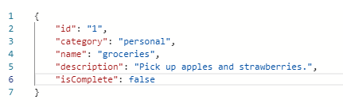

# CosmosDB

## Exercise
- Get familiar with CosmosDB and how to use it

### Sources
[Cosmos DB explained](https://docs.microsoft.com/en-us/azure/cosmos-db/introduction)

[CosmosDB tutorial](https://docs.microsoft.com/en-us/azure/cosmos-db/sql/create-cosmosdb-resources-portal)

### Overcome challenges
- Learned how to use CosmosDB

### Results

## **What is CosmosDB?**
Azure Cosmos DB is a fully managed NoSQL database service for building scalable, high performance applications. Azure Cosmos DB takes database administration off your hands with automatic management, updates and patching. It also handles capacity management with cost-effective serverless and automatic scaling options that respond to application needs to match capacity with demand.

All together the key benefits of using CosmosDB are:
- Guaranteed speed at any scale
- Simplified App development
- Mission critical ready
- Fully managed
- Cost effective

## **How do you use CosmosDB?**
To get familiar with CosmosDB, we can use the following [tutorial](https://docs.microsoft.com/en-us/azure/cosmos-db/sql/create-cosmosdb-resources-portal).

- Firstly, we create an Azure Cosmos DB account. We use the Core(SQL) API for this tutorial, as it is the simplest to use. Also, we use a serverless capacity mode. This will ensure that we don't pay for what we don't need, and it takes less configuration to set up.

- We have the option to add availability zones, to improve the availability and resiliency of the database. For now we leave this disabled.

- We can also adjust the backup settings. It allows us to configure the policy, interval, retention time, amount of copies and the backup storage redundancy. For now we choose LRS(locally0redundant backup storage).

- Next, we create a database and a container. After navigating to "data explorer", we can add a container.

- We can add new items, by pressing the new items button, and using the following code to add an item to our "To do list".

