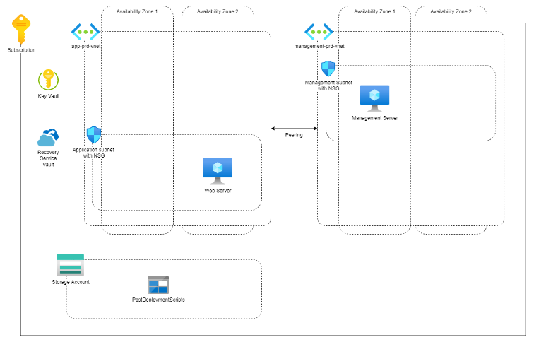

# **Requirements for v1.0**

A business is transfering from an on-prem architecture to a cloud solution. These are the hard requirements for the transfer:

- All VM disks have to be encrypted !!!
- The webserver needs daily back-up. Back-up need to be stored for 7 days.
- The webserver needs to be installed in an automatic fashion.
- The admin/management server has to be reachable with a public IP
- The admin/management server can only be accessed from trusted locations(office/admin's home) !!!
- The following IP-ranges can be used: 10.10.10.0/24 & 10.20.20.0/24
- All subnets need firewall protection on subnet level
- SSH or RDP connections with the webserver only allowed via the admin server.
- Needs a storage solution for bootstrap/post-deployment scripts that can not be accessed by the public.

The following architecture is representation of the on-premises architecture:

